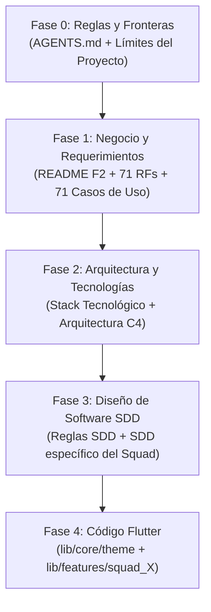

# Regla de Navegación y Secuencia de Lectura Obligatoria

### Sistema de Gestión Escolar — Guamán Poma de Ayala (UNSCH)
**Aplicable a:** Desarrolladores, Líderes de Squad, Evaluadores y Agentes de IA  
**Propósito:** Evitar la desorientación, el extravío documental y el desvío de alcance (*scope creep*).

---

## 1. DIRECTIVA DE NAVEGACIÓN SECUENCIAL (LEER EN ESTE ORDEN)

> [!IMPORTANT]
> **REGLA MANDATORIA DE LECTURA:**  
> Ningún desarrollador ni agente debe modificar código ni crear documentos sin haber consultado los documentos en el orden estricto de las 5 fases descritas a continuación.

---

## 2. RUTA DETALLADA PASO A PASO

### FASE 0: Reglas Maestras y Límites del Alcance (Primero que nada — 5 minutos)
Antes de responder preguntas o escribir código, se deben fijar las reglas del juego:
1. 📄 [`AGENTS.md`](file:///d:/zapata%202026%20-%20II/school-management-system/AGENTS.md): Contexto general del SSU IS-480, distribución de los 5 squads, GitFlow y directivas Flutter.
2. 📄 [`D - Base 1 - 01092026/Fase 2/limites_y_alcance_proyecto.md`](file:///d:/zapata%202026%20-%20II/school-management-system/D%20-%20Base%201%20-%2001092026/Fase%202/limites_y_alcance_proyecto.md): Conocer la **matriz Out-of-Scope** y las **10 reglas de alto al alcance** para no construir funcionalidades prohibidas (sin pasarelas de pago, sin apps nativas, sin módulos de biblioteca/comedor).

---

### FASE 1: Entendimiento Funcional del Sistema (Qué hace el sistema)
Comprender la lógica institucional de los Planteles de Aplicación:
3. 📄 [`D - Base 1 - 01092026/Fase 2/README.md`](file:///d:/zapata%202026%20-%20II/school-management-system/D%20-%20Base%201%20-%2001092026/Fase%202/README.md): Índice canónico de toda la Fase 2.
4. 📄 [`D - Base 1 - 01092026/Fase 2/Requisitos Funcionales/requisitos_funcionales.md`](file:///d:/zapata%202026%20-%20II/school-management-system/D%20-%20Base%201%20-%2001092026/Fase%202/Requisitos%20Funcionales/requisitos_funcionales.md): Los **71 Requisitos Funcionales (`RF-01` al `RF-71`)** con sus precondiciones, entradas y salidas.
5. 📄 [`D - Base 1 - 01092026/Fase 2/Casos de uso/README.md`](file:///d:/zapata%202026%20-%20II/school-management-system/D%20-%20Base%201%20-%2001092026/Fase%202/Casos%20de%20uso/README.md): Los **71 Casos de Uso UML** y el comportamiento de los actores escolares.
6. 📄 [`D - Base 1 - 01092026/Fase 2/Requisitos No Funcionales/requisitos_no_funcionales.md`](file:///d:/zapata%202026%20-%20II/school-management-system/D%20-%20Base%201%20-%2001092026/Fase%202/Requisitos%20No%20Funcionales/requisitos_no_funcionales.md): Los 20 RNFs (seguridad, tiempos P95 < 3s, debounce 400ms, accesibilidad).

---

### FASE 2: Arquitectura y Ecosistema Tecnológico (Cómo está construido)
Conocer la infraestructura y tecnologías aprobadas:
7. 📄 [`D - Base 1 - 01092026/Fase 2/stack_tecnologico_proyecto.md`](file:///d:/zapata%202026%20-%20II/school-management-system/D%20-%20Base%201%20-%2001092026/Fase%202/stack_tecnologico_proyecto.md): Ecosistema oficial (Flutter 3.35, Dart 3.9, Node.js/TypeScript, PostgreSQL Multi-Tenant, Redis, Hive Offline-First, SHA-256).
8. 📄 [`D - Base 1 - 01092026/Fase 2/Arquitectura/arquitectura_sistema.md`](file:///d:/zapata%202026%20-%20II/school-management-system/D%20-%20Base%201%20-%2001092026/Fase%202/Arquitectura/arquitectura_sistema.md): Diagramas C4, Clean Architecture y reparto técnico de responsabilidades en los 5 squads.
9. 📄 [`D - Base 1 - 01092026/Fase 2/Requisitos Funcionales/requisitos_funcionales_tecnicos.md`](file:///d:/zapata%202026%20-%20II/school-management-system/D%20-%20Base%201%20-%2001092026/Fase%202/Requisitos%20Funcionales/requisitos_funcionales_tecnicos.md): Contratos de API REST JSON, esquema multi-tenant (`tenant_id`), schemas SQL y WebSockets.

---

### FASE 3: Documento de Diseño de Software del Squad (Especificación IEEE 1016)
Antes de codificar o refactorizar un módulo en particular:
10. 📄 [`.agents/rules/sdd_rules.md`](file:///d:/zapata%202026%20-%20II/school-management-system/.agents/rules/sdd_rules.md): Reglas canónicas para los SDDs.
11. 📄 Consultar la carpeta de arquitectura del Squad correspondiente:
    * **Squad 1 (Core y Seguridad):** `D - Base 1 - 01092026/Fase 2/Arquitectura/Squad 1 - Core y Seguridad/sdd_squad_1.md`
    * **Squad 2 (Matrícula y Asistencia):** `D - Base 1 - 01092026/Fase 2/Arquitectura/Squad 2 - Matricula y Asistencia/`
    * **Squad 3 (Calificaciones y Modo Excel):** `D - Base 1 - 01092026/Fase 2/Arquitectura/Squad 3 - Calificaciones y Modo Excel/`
    * **Squad 4 (Analítica y Dashboards):** `D - Base 1 - 01092026/Fase 2/Arquitectura/Squad 4 - Analitica y Dashboards/`
    * **Squad 5 (Secretaría y Portal Web):** `D - Base 1 - 01092026/Fase 2/Arquitectura/Squad 5 - Secretaria y Portal Web/`

---

### FASE 4: Construcción de Código en Flutter (Manos a la obra)
Directivas para implementar pantallas, widgets y lógica:
12. 📄 [`lib/core/theme/app_theme.dart`](file:///d:/zapata%202026%20-%20II/school-management-system/lib/core/theme/app_theme.dart): Usar únicamente los colores y estilos definidos (Verde Botella `#1B4D3E`, Azul UNSCH `#0B2F64`, CNEB AD/A/B/C).
13. 📄 Ubicar el código **exclusivamente** en su respectiva carpeta Feature-First:
    * `lib/features/squad_1_core_seguridad/`
    * `lib/features/squad_2_matricula_asistencia/`
    * `lib/features/squad_3_calificaciones/`
    * `lib/features/squad_4_analitica_dashboards/`
    * `lib/features/squad_5_secretaria_portal/`
14. 🛠️ **Comandos de Verificación Obligatorios:**
    * `flutter analyze`: Debe finalizar con **0 errores y 0 warnings**.
    * `flutter test`: Todas las pruebas deben pasar al 100%.

---

## 3. CHECKLIST RÁPIDO DE PREVENCIÓN DE EXTRAVÍO

Antes de dar por concluida cualquier tarea, responder afirmativamente:
- [ ] ¿El requerimiento que toqué está entre el `RF-01` y el `RF-71`?
- [ ] ¿Verifiqué que no está en la lista de prohibiciones de `limites_y_alcance_proyecto.md`?
- [ ] ¿El código que escribí está dentro de `lib/features/squad_[X]_[modulo]/`?
- [ ] ¿Utilicé los tokens de `AppTheme` y no colores genéricos o ad-hoc?
- [ ] ¿Ejecuté `flutter analyze` y obtuve *"No issues found!"*?
