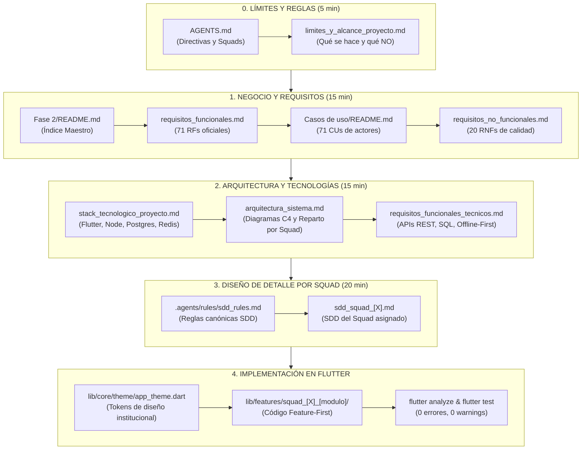

# Skill: Guía de Navegación y Secuencia de Lectura Obligatoria

Esta skill define la **ruta de aprendizaje y orden de lectura secuencial** del repositorio del Sistema de Gestión Escolar — Planteles de Aplicación "Guamán Poma de Ayala" (UNSCH - SSU IS-480).

Su objetivo es evitar la sobrecarga de información, garantizar que nadie comience a programar antes de entender los límites del proyecto y erradicar el *scope creep* (construir cosas que no corresponden).

---

## 1. Cuándo Activar esta Skill

Activa esta skill cuando:
* Un desarrollador o agente nuevo pregunte: *"¿Por dónde empiezo?"*, *"¿Qué debo leer primero?"*, *"Estoy perdido en los documentos"* o *"¿Dónde está la arquitectura?"*.
* Se necesite auditar si el equipo está siguiendo la secuencia lógica de desarrollo.
* Se proponga una funcionalidad y se requiera verificar en qué documento está normada o si está prohibida (fuera de alcance).

---

## 2. Mapa de Navegación Secuencial (El Orden Obligatorio)

---

## 3. Guía de Lectura Rápida: "¿Qué debo leer si quiero...?"

| Si necesitas saber... | Documento obligatorio a consultar | Ubicación en el repositorio |
|---|---|---|
| **¿Quién hace qué en mi equipo?** | [AGENTS.md](file:///d:/zapata%202026%20-%20II/school-management-system/AGENTS.md) | Raíz del proyecto |
| **¿Qué funciones están prohibidas y dónde termina el proyecto?** | [limites_y_alcance_proyecto.md](file:///d:/zapata%202026%20-%20II/school-management-system/D%20-%20Base%201%20-%2001092026/Fase%202/limites_y_alcance_proyecto.md) | `D - Base 1 - 01092026/Fase 2/` |
| **¿Cuáles son los 71 requerimientos del colegio?** | [requisitos_funcionales.md](file:///d:/zapata%202026%20-%20II/school-management-system/D%20-%20Base%201%20-%2001092026/Fase%202/Requisitos%20Funcionales/requisitos_funcionales.md) | `D - Base 1 - 01092026/Fase 2/Requisitos Funcionales/` |
| **¿Cómo interactúan los profesores y alumnos?** | [Casos de uso/README.md](file:///d:/zapata%202026%20-%20II/school-management-system/D%20-%20Base%201%20-%2001092026/Fase%202/Casos%20de%20uso/README.md) | `D - Base 1 - 01092026/Fase 2/Casos de uso/` |
| **¿Qué versiones de Flutter, Node, Postgres y Redis usamos?** | [stack_tecnologico_proyecto.md](file:///d:/zapata%202026%20-%20II/school-management-system/D%20-%20Base%201%20-%2001092026/Fase%202/stack_tecnologico_proyecto.md) | `D - Base 1 - 01092026/Fase 2/` |
| **¿Cómo se conectan el Frontend, Backend, Redis y PostgreSQL?** | [arquitectura_sistema.md](file:///d:/zapata%202026%20-%20II/school-management-system/D%20-%20Base%201%20-%2001092026/Fase%202/Arquitectura/arquitectura_sistema.md) | `D - Base 1 - 01092026/Fase 2/Arquitectura/` |
| **¿Cuáles son los endpoints JSON y estructuras de tablas SQL?** | [requisitos_funcionales_tecnicos.md](file:///d:/zapata%202026%20-%20II/school-management-system/D%20-%20Base%201%20-%2001092026/Fase%202/Requisitos%20Funcionales/requisitos_funcionales_tecnicos.md) | `D - Base 1 - 01092026/Fase 2/Requisitos Funcionales/` |
| **¿Cómo redactar el Documento de Diseño de Software (SDD)?** | [.agents/rules/sdd_rules.md](file:///d:/zapata%202026%20-%20II/school-management-system/.agents/rules/sdd_rules.md) | `.agents/rules/` |
| **¿Qué colores, fuentes y espaciados debo usar en Flutter?** | [lib/core/theme/app_theme.dart](file:///d:/zapata%202026%20-%20II/school-management-system/lib/core/theme/app_theme.dart) | `lib/core/theme/` |

---

## 4. Los 5 Errores Fatales que Provocan Desorientación

1. **Error 1: Programar antes de leer los 71 RFs.**  
   *Consecuencia:* Crear pantallas bonitas que no cumplen con los criterios de aceptación del MINEDU ni del colegio.
2. **Error 2: Inventar funcionalidades financieras o de pagos.**  
   *Consecuencia:* Infringir el documento de límites. El sistema no maneja dinero, matrículas pagadas ni facturación SUNAT.
3. **Error 3: Colocar pantallas fuera de `lib/features/squad_[X]_[modulo]/`.**  
   *Consecuencia:* Romper la arquitectura modular Feature-First y generar conflictos de merge en Git.
4. **Error 4: Hardcodear colores o estilos en los widgets.**  
   *Consecuencia:* Romper la identidad visual institucional (Verde botella, Azul UNSCH y escala CNEB oficial). Usar siempre `AppTheme`.
5. **Error 5: Enviar código sin ejecutar `flutter analyze` y `flutter test`.**  
   *Consecuencia:* Bloquear la integración continua (`dev`) con warnings o tests rotos.
