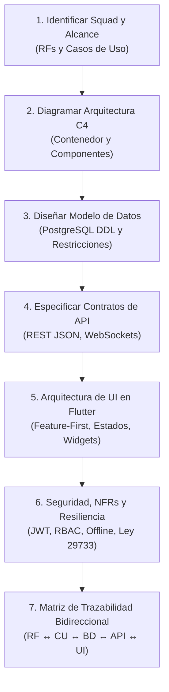

# Skill: Elaboración de Documentos de Diseño de Software (SDD)

Esta skill proporciona el procedimiento paso a paso, los estándares normativos y la plantilla canónica para redactar el **Documento de Diseño de Software (SDD - Software Design Document)** de cualquier Squad o módulo del Sistema de Gestión Escolar de los Planteles de Aplicación "Guamán Poma de Ayala" (UNSCH - SSU IS-480).

---

## 1. Cuándo Activar esta Skill

Activa esta skill cuando:
* Un desarrollador o squad pregunte: *"¿Cómo empiezo mi SDD?"*, *"Crea el SDD para el Squad X"*, o *"Estructura el documento de diseño de software"*.
* Se requiera formalizar la arquitectura de detalle antes de implementar código en Flutter o Backend.
* Se necesite auditar o verificar que un SDD cumple con la trazabilidad hacia los Requisitos Funcionales (`RF-XX`) y Casos de Uso (`CU-XXX`).

---

## 2. Flujo de Trabajo para Elaborar un SDD (Paso a Paso)

### Paso 1: Definir Identidad y Alcance del Squad
* Consultar la asignación de responsabilidades:
  * **Squad 1 (Brandon Montero):** M1, M2, M3, M12 (RF-01 al RF-14, RF-65 al RF-68) — Core, Seguridad, RBAC, Auditoría.
  * **Squad 2 (Sebastián Paipay):** M4, M5, M6, M7 (RF-15 al RF-35) — Matrícula, Kiosco Offline-First, QR, Horas SSU.
  * **Squad 3 (Steve Ovalle):** M8 (RF-36 al RF-46) — Planilla "Modo Excel", Debounce 400ms, Conclusiones MINEDU, Escala Dual.
  * **Squad 4 (Aracely Rodríguez):** M9, M10 (RF-47 al RF-58) — Mapas de Calor Drill-Down, Ficha 360°, Deserción, Tablero SSU.
  * **Squad 5 (Cesar Leon):** M11, M13 (RF-59 al RF-64, RF-69 al RF-71) — Libretas PDF, Verificación QR SHA-256, Portal Web.

### Paso 2: Vistas Arquitecturales y Diagramas C4
* Generar diagrama Mermaid de contexto y componentes:
  * Interacción entre Frontend Flutter (Web/Desktop/Mobile).
  * API Gateway / Capa de Controladores REST y WebSockets.
  * Capa de Servicios de Dominio y Lógica de Negocio.
  * Capa de Persistencia: PostgreSQL Multi-Tenant (`tenant_id`), Redis y Almacenamiento Local (Hive/IndexedDB para Offline).

### Paso 3: Diseño Detallado de Base de Datos
* Especificar tablas con tipos de datos nativos de PostgreSQL:
  * Claves primarias UUID (`gen_random_uuid()`).
  * Claves foráneas con integridad referencial (`ON DELETE RESTRICT`).
  * Campos de auditoría obligatorios: `created_at`, `updated_at`, `created_by`, `tenant_id`.
  * Triggers de inmutabilidad en tablas sensibles (ej. `audit_logs`, `grade_history`).

### Paso 4: Especificación de Contratos de API
* Definir endpoints siguiendo la convención:
  * `POST /api/v1/{recurso}` (Creación)
  * `GET /api/v1/{recurso}?page=1&limit=20` (Listado paginado)
  * `GET /api/v1/{recurso}/:id` (Detalle)
  * `PUT / PATCH /api/v1/{recurso}/:id` (Actualización)
  * `DELETE /api/v1/{recurso}/:id` (Baja lógica `is_active = false`)
* Formato JSON estricto: Incluir esquema de solicitud (`Request`) y respuesta exitosa (`200/201 OK`) y de error (`400/401/403/422`).

### Paso 5: Diseño Frontend en Flutter (Feature-First)
* Estructurar el módulo bajo `lib/features/{squad_name}/`:
  * `presentation/screens/`: Pantallas principales de la funcionalidad.
  * `presentation/widgets/`: Widgets interactivos especializados.
  * `presentation/controllers/`: Manejador de estado reactivo.
  * `domain/models/`: Entidades inmutables de negocio.
  * `data/repositories/`: Consumo de API y persistencia local.

### Paso 6: Requisitos No Funcionales (NFR) y Seguridad
* Latencia: < 500 ms en consultas comunes; < 300 ms en escaneo Kiosco; 60 FPS en planilla Excel.
* Resiliencia Offline: Búfer local capaz de almacenar al menos 2,000 registros desconectados.
* Seguridad: Cero almacenamiento de contraseñas en texto plano (bcrypt coste >= 12), protección de datos de menores (Ley 29733).

### Paso 7: Matriz de Trazabilidad
* Toda tabla, endpoint y pantalla debe mapear explícitamente a su código de Requisito Funcional (`RF-XX`) y Caso de Uso (`CU-XXX`).

---

## 3. Recursos y Plantilla Maestra

Para iniciar la redacción de un SDD de inmediato, utilizar la plantilla canónica:
* 📄 **[Plantilla Canónica SDD (IEEE 1016)](./resources/plantilla_sdd.md)**

---

## 4. Validación del SDD Terminado

Antes de dar por concluido un SDD, verificar:
1. ¿Cubre el 100% de los RF asignados al Squad?
2. ¿Los diagramas Mermaid compilan sin errores de sintaxis?
3. ¿Los contratos JSON incluyen tipos de datos válidos?
4. ¿El esquema SQL respeta el aislamiento multi-tenant (`tenant_id`)?
5. ¿La estructura de Flutter se alinea con `lib/features/{squad}/`?
