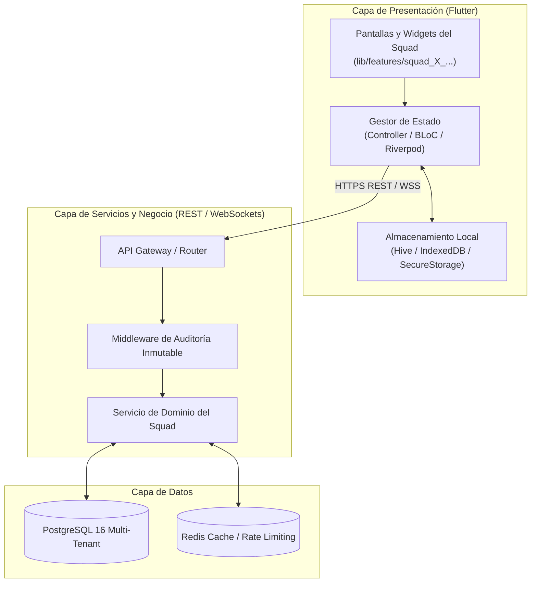
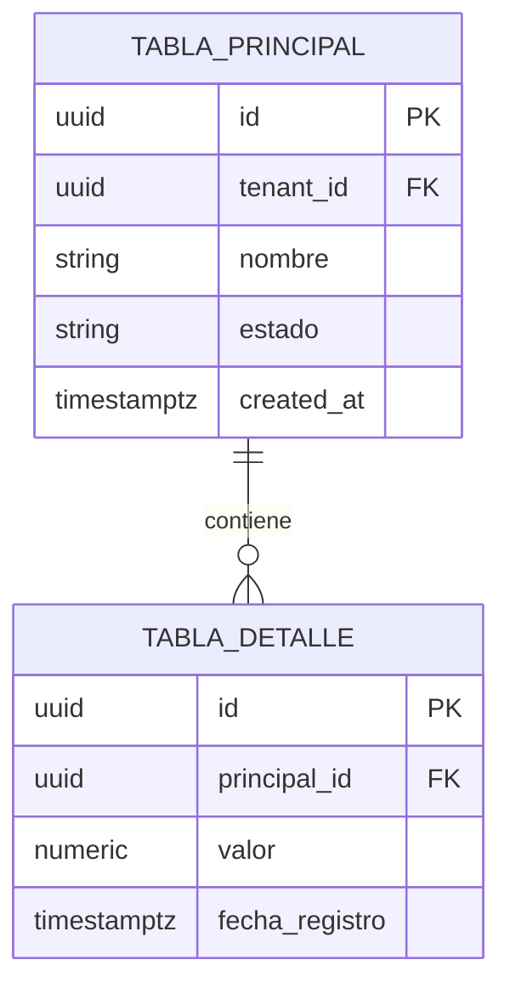

# Documento de Diseño de Software (SDD) — [NOMBRE DEL SQUAD]

### Planteles de Aplicación "Guamán Poma de Ayala" — UNSCH
**Servicio Social Universitario IS-480 (2026-II)**  
**Estándar Normativo:** IEEE 1016-2009 / ISO/IEC/IEEE 42010

---

## Metadatos del Documento

| Campo | Detalle |
|---|---|
| **Squad Responsable** | [Squad X: Nombre del Squad] |
| **Líder Técnico** | [Nombres y Apellidos Completos] (`@[github-username]`) |
| **Rama de Desarrollo** | `feature/squad-[X]/[nombre-modulo]` |
| **Módulos Asignados** | [Módulo X, Módulo Y] |
| **Requisitos Trazables** | `RF-[XX]` al `RF-[YY]` ([Total] Requisitos Funcionales) |
| **Casos de Uso** | `CU-[XXX]-[01]` al `CU-[XXX]-[NN]` |
| **Versión del SDD** | v1.0.0 |
| **Estado** | [Borrador / En Revisión / Aprobado] |

---

## 1. Introducción y Alcance del Módulo

### 1.1. Propósito del Documento
El presente Documento de Diseño de Software (SDD) describe la arquitectura técnica, el diseño detallado de componentes, los modelos de persistencia relacional, los contratos de comunicación API y la estructura de presentación en Flutter para implementar los requisitos asignados al **[Squad X]**.

### 1.2. Alcance Funcional
* [Resumen de funcionalidades que cubre el squad].
* [Población objetivo: Docentes, Estudiantes, Directivos, Portería, etc.].

### 1.3. Supuestos y Restricciones Técnicas
* **Framework Frontend:** Flutter 3.35+ (WebAssembly / Web / Mobile) bajo patrón Feature-First.
* **Backend:** Arquitectura RESTful con autenticación JWT y WebSockets para eventos reactivos.
* **Base de Datos:** PostgreSQL 16 con particionamiento lógico multi-tenant (`tenant_id`).
* **Estándar de Seguridad:** Cumplimiento de la Ley N.° 29733 (Protección de Datos Personales del Perú) y OWASP Top 10.

---

## 2. Vista Arquitectural del Módulo (Modelo C4)

### 2.1. Diagrama de Contenedores y Flujo de Componentes



### 2.2. Descripción de Componentes Principales

| Componente | Responsabilidad | Tecnologías / Librerías |
|---|---|---|
| `[NombreComponenteUI]` | [Responsabilidad visual] | Flutter Widget, Material 3 |
| `[NombreService]` | [Lógica de negocio y reglas del CNEB] | Dart / Node.js / Python |
| `[NombreRepository]` | [Acceso a datos y caché local] | Dio, Hive, Http |

---

## 3. Diseño Detallado de Persistencia (PostgreSQL)

### 3.1. Modelo Entidad-Relación del Squad



### 3.2. Diccionario de Datos y DDL

```sql
-- DDL para el Squad X
CREATE TABLE IF NOT EXISTS esquema_squad.nombre_tabla (
    id UUID PRIMARY KEY DEFAULT gen_random_uuid(),
    tenant_id VARCHAR(50) NOT NULL,
    codigo_institucional VARCHAR(30) UNIQUE NOT NULL,
    nombre VARCHAR(150) NOT NULL,
    metadata JSONB DEFAULT '{}'::jsonb,
    is_active BOOLEAN DEFAULT TRUE NOT NULL,
    created_at TIMESTAMPTZ DEFAULT CURRENT_TIMESTAMP NOT NULL,
    updated_at TIMESTAMPTZ DEFAULT CURRENT_TIMESTAMP NOT NULL,
    created_by UUID NOT NULL
);

-- Índices de alto rendimiento
CREATE INDEX idx_nombre_tabla_tenant ON esquema_squad.nombre_tabla (tenant_id);
CREATE INDEX idx_nombre_tabla_codigo ON esquema_squad.nombre_tabla (codigo_institucional);
```

---

## 4. Contratos de Comunicación (API REST & WebSockets)

### 4.1. Endpoint: [Nombre de la Operación]
* **Método:** `POST` / `GET` / `PUT` / `DELETE`
* **Ruta:** `/api/v1/[recurso]`
* **Autenticación:** `Bearer <JWT>` (Roles requeridos: `[ROLES]`)
* **Headers:** `Content-Type: application/json`, `X-Tenant-ID: [tenant]`

#### Cuerpo de Solicitud (Request Payload JSON):
```json
{
  "campo_uno": "valor",
  "campo_dos": 123
}
```

#### Respuesta Exitosa (`200 OK` / `201 Created`):
```json
{
  "success": true,
  "data": {
    "id": "a0eebc99-9c0b-4ef8-bb6d-6bb9bd380a11",
    "status": "PROCESSED"
  },
  "timestamp": "2026-09-22T08:30:00Z"
}
```

#### Respuestas de Error:
* `400 Bad Request`: Parámetros inválidos o fuera de rango.
* `401 Unauthorized`: Token JWT expirado o ausente.
* `403 Forbidden`: Rol sin privilegios para esta acción.
* `422 Unprocessable Entity`: Violación de regla de negocio pedagógica.

---

## 5. Diseño de Interfaz de Usuario en Flutter (Feature-First)

### 5.1. Estructura de Directorios del Feature

```text
lib/features/squad_[X]_[nombre]/
├── presentation/
│   ├── screens/                  # Vistas principales del módulo
│   ├── widgets/                  # Componentes reutilizables internos
│   └── controllers/              # Notificadores de estado reactivo
├── domain/
│   └── models/                   # Entidades inmutables de negocio
├── data/
│   ├── datasources/              # Clientes HTTP / Local Storage
│   └── repositories/             # Implementación de repositorios
└── squad_[X]_[nombre].dart        # Barrel file de exportación
```

### 5.2. Flujo y Ergonomía Visual de Pantallas
* [Descripción del comportamiento ante interacción del usuario].
* [Manejo de estados: Cargando (Shimmer/Spinner), Éxito, Vacío y Error con reintento].

---

## 6. Seguridad, Resiliencia y Atributos de Calidad (NFR)

* **Rendimiento:** Tiempos de respuesta de API inferiores a [X] ms.
* **Resiliencia:** [Estrategia Offline-First / Reintentos con Backoff Exponencial / Búfer local].
* **Auditoría:** Todo cambio de estado crítico inserta automáticamente un registro inmutable en `audit_logs`.
* **Privacidad:** Anonimización y enmascaramiento de datos personales según la Ley 29733.

---

## 7. Matriz de Trazabilidad Bidireccional

| Requisito | Caso de Uso | Tabla(s) PostgreSQL | Endpoint(s) API | Pantalla / Widget Flutter |
|---|---|---|---|---|
| `RF-[XX]` | `CU-[XXX]-[01]` | `tabla_uno` | `POST /api/v1/recurso` | `RecursoScreen` |
| `RF-[YY]` | `CU-[XXX]-[02]` | `tabla_dos` | `GET /api/v1/recurso` | `RecursoListWidget` |
