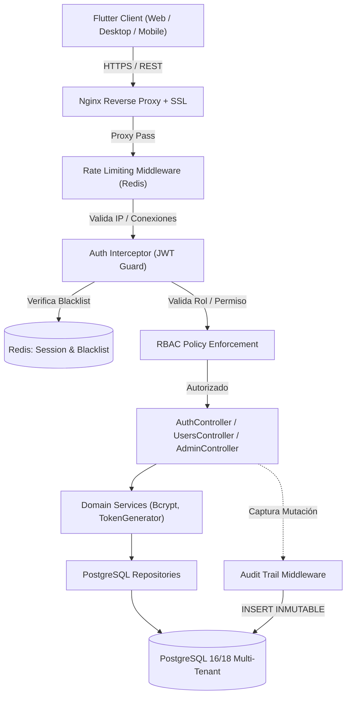
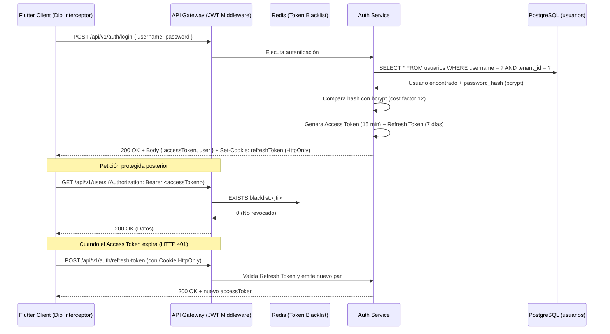

# Arquitectura Técnica: Core, Seguridad, Multi-Tenant y Auditoría

**Squad:** Squad 1 - Core y Seguridad  
**Líder Técnico:** Brandon Fernando Montero Gutiérrez (`@brandonmontero27-g`)  
**Rama de Desarrollo:** `feature/squad-1/auth-core`  
**Requisitos Asociados:** [`Fase 2/Requisitos Funcionales/Squad 1 - Core y Seguridad/`](../../Requisitos%20Funcionales/Squad%201%20-%20Core%20y%20Seguridad/README.md) (`RF-01` al `RF-14`, `RF-65` al `RF-68`)  

---

## 1. Patrones de Diseño y Decisiones Arquitectónicas (ADRs)

1. **Autenticación Dual-Token JWT (Access + Refresh):**
   * *Access Token:* 15 minutos de vida útil, firmado con HMAC-SHA256, transportado en cabecera `Authorization: Bearer <token>`.
   * *Refresh Token:* 7 días de vida útil, almacenado exclusivamente en una cookie `HttpOnly`, `Secure`, `SameSite=Strict` para mitigar ataques XSS y robo de tokens.
2. **Revocación Activa de Sesiones con Redis Token Blacklist:**
   * Al cerrar sesión o detectar anomalías, el JTI (JWT ID) se inserta en Redis con TTL igual al tiempo remanente del token, rechazando peticiones futuras en menos de 2 ms.
3. **Aislamiento Multi-Tenant (Segregación Lógica):**
   * Todas las entidades maestras y transaccionales incluyen la clave discriminadora `tenant_id` (asociada a la sede institucional).
   * Un interceptor en el backend inyecta automáticamente la condición `WHERE tenant_id = :current_tenant` en todas las consultas del ORM.
4. **Auditoría Inmutable (Ley N.° 29733):**
   * Tabla `logs_auditoria` con reglas a nivel de motor PostgreSQL que revoca privilegios de `UPDATE` y `DELETE` para cualquier usuario, incluso el de la aplicación.
   * Registro diferencial del payload (`before` y `after` en columnas `JSONB`).

---

## 2. Diagrama de Componentes C4 (Seguridad y Core)

---

## 3. Diagrama de Secuencia: Flujo de Autenticación y Rotación de Token

---

## 4. Arquitectura de Estado en Frontend (Flutter)

* **Gestión de Estado:** `flutter_bloc` / BLoC Pattern.
* **Módulos:**
  * `lib/features/auth/domain/bloc/auth_bloc.dart`: Estados (`AuthInitial`, `AuthLoading`, `Authenticated`, `Unauthenticated`, `AuthError`).
  * `lib/core/network/auth_interceptor.dart`: Interceptor de `Dio` que intercepta respuestas `401 Unauthorized`, pausa las peticiones en cola, llama al endpoint de refresh y reintenta la petición fallida sin intervención del usuario.
  * `lib/core/storage/secure_storage_service.dart`: Encapsulamiento de `flutter_secure_storage` para el Access Token en memoria cifrada.

---

## 5. Artefactos Técnicos en este Directorio
* 📄 **[esquema_datos.sql](esquema_datos.sql)**: Definición DDL formal de tablas, tipos ENUM, índices B-Tree y triggers de auditoría inmutable.
* 📄 **[contratos_api.md](contratos_api.md)**: Especificación formal de endpoints REST, esquemas de DTO JSON y códigos de estado HTTP.
