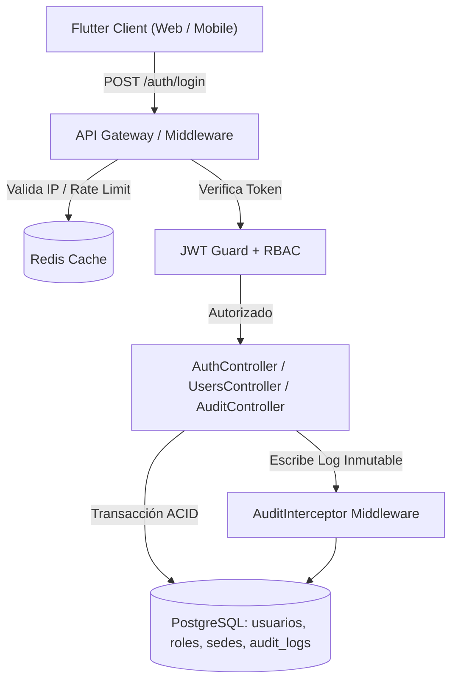

# SQUAD 1: Core, Seguridad, Configuración Escolar y Auditoría

**Responsable Técnico:** Brandon Fernando Montero Gutiérrez (`@brandonmontero27-g`)  
**Rol:** Backend & Database Lead / Security Engineer  
**Rama Git Principal:** `feature/squad-1/auth-core`  
**Total de Requisitos:** **18 Requisitos Funcionales**  

---

---

## 📁 Documentación y Alcance Técnico del Squad

1. 📄 **[Catálogo de Requisitos Funcionales del Squad](../../Requisitos%20Funcionales/Squad%201%20-%20Core%20y%20Seguridad/README.md)**: Especificación individual de los 18 Requisitos Funcionales asignados (ubicados en `Fase 2/Requisitos Funcionales/Squad 1 - Core y Seguridad/`).
2. 🛠️ **[Diseño Técnico de Software](Diseno%20Tecnico/README.md)**: Arquitectura técnica interna, modelo de datos relacional (PostgreSQL), endpoints API REST, WebSockets y diseño de componentes Flutter.

## 1. Módulos y Requisitos Asignados

### Módulo 1: Acceso, Autenticación JWT y RBAC (`RF-01` al `RF-04`)
* `RF-01`: Inicio de Sesión Centralizado con JWT (Access Token 15 min + Refresh Token 7 días en HttpOnly Cookie).
* `RF-02`: Control de Acceso Basado en Roles (RBAC) con 5 perfiles: SuperAdmin, Directivo, Docente, Estudiante/Apoderado, Portería/Auxiliar.
* `RF-03`: Recuperación Segura de Contraseñas mediante token temporal firmado de un solo uso (vigencia 30 min).
* `RF-04`: Cierre de Sesión Seguro y Revocación Activa de Tokens en lista negra (Redis Token Blacklist).

### Módulo 2: Administración de Usuarios y Directorio Institucional (`RF-05` al `RF-09`)
* `RF-05`: Gestión Integral de Usuarios (Alta, Baja lógica, Edición, Asignación de Roles y Sedes).
* `RF-06`: Importación Masiva de Docentes, Personal y Estudiantes desde archivos Excel (.xlsx / .csv) con validación previa de duplicados y DNI.
* `RF-07`: Gestión de Sedes y Planteles Escolares bajo esquema Multi-Tenant (aislamiento lógico por `tenant_id`).
* `RF-08`: Directorio Escolar y Búsqueda Rápida con autocompletado y filtros por rol, nivel, grado y estado.
* `RF-09`: Perfil de Usuario y Cambio Autónomo de Credenciales y Preferencias de Notificación.

### Módulo 3: Configuración Escolar, Periodos y Escalas (`RF-10` al `RF-14`)
* `RF-10`: Configuración del Año Lectivo Oficial y Calendario Escolar (fechas de inicio, término y recesos).
* `RF-11`: Parametrización de Periodos Académicos (Bimestres / Trimestres) con fechas de apertura y cierre estricto de actas.
* `RF-12`: Configuración de Turnos, Niveles (Inicial, Primaria, Secundaria) y Horarios de Ingreso/Salida con tolerancia de tardanzas.
* `RF-13`: Definición de Escalas de Calificación Institucional (Dual: Vigesimal 0-20 y Cualitativa CNEB AD, A, B, C).
* `RF-14`: Parámetros Globales del Sistema (Logo del colegio, lema oficial, datos del director para cabeceras de boletas).

### Módulo 12: Trazabilidad, Auditoría Inmutable y Ley N.° 29733 (`RF-65` al `RF-68`)
* `RF-65`: Registro Inmutable de Auditoría en Base de Datos (captura de `usuario_id`, `accion`, `tabla`, `registro_id`, `ip_origen`, `user_agent`, `payload_before`, `payload_after`, `timestamp`).
* `RF-66`: Visor Directivo de Logs de Auditoría con filtros por fecha, usuario, módulo y tipo de acción con exportación en PDF no modificable.
* `RF-67`: Cumplimiento de la Ley de Protección de Datos Personales (Ley N.° 29733): Encriptación en reposo de datos sensibles de menores (bcrypt para contraseñas, enmascaramiento de teléfonos y direcciones).
* `RF-68`: Políticas de Retención, Respaldo Automatizado Diario y Bloqueo de Modificaciones a Registros Históricos cerrados.

---

## 2. Arquitectura Técnica del Squad

---

## 3. Modelo de Datos a Implementar (PostgreSQL)

Tablas principales a estructurar en las migraciones:
1. `instituciones` (`id`, `nombre`, `codigo_modular`, `activo`, `created_at`)
2. `usuarios` (`id`, `tenant_id`, `username`, `email`, `password_hash`, `dni`, `nombres`, `apellidos`, `telefono`, `estado`, `created_at`)
3. `roles` (`id`, `codigo`, `nombre_legible`, `descripcion`)
4. `usuario_roles` (`usuario_id`, `rol_id`)
5. `anios_lectivos` (`id`, `tenant_id`, `anio`, `fecha_inicio`, `fecha_fin`, `estado_abierto`)
6. `periodos_academicos` (`id`, `anio_lectivo_id`, `numero_periodo`, `tipo_periodo`, `fecha_inicio`, `fecha_fin`, `cerrado`)
7. `logs_auditoria` (`id`, `tenant_id`, `usuario_id`, `accion`, `modulo`, `ip_address`, `detalles_json`, `created_at`)

---

## 4. Endpoints y Contratos API a Desarrollar

* `POST /api/v1/auth/login` (body: `{ username, password }` -> returns `{ user, accessToken }` + set HttpOnly Cookie `refreshToken`)
* `POST /api/v1/auth/refresh-token` (lee cookie -> retorna nuevo `accessToken`)
* `POST /api/v1/auth/logout` (invalida token en Redis)
* `GET  /api/v1/users` (filtros: `rol`, `estado`, `query`, paginación)
* `POST /api/v1/users/import-excel` (subida multipart/form-data con procesamiento streaming)
* `GET  /api/v1/academic-years/current` (retorna configuración activa del año y periodos)
* `GET  /api/v1/audit/logs` (solo rol Directivo/SuperAdmin, paginado y exportable)

---

## 5. Componentes y Vistas Frontend (Flutter)

* `lib/features/auth/presentation/pages/login_page.dart` (Diseño limpio, validación reactiva, feedback de credenciales erróneas).
* `lib/features/admin_config/presentation/pages/users_list_page.dart` (Tabla paginada con acciones rápidas, filtros por rol y botón de importación Excel).
* `lib/features/admin_config/presentation/widgets/user_form_modal.dart` (Modal de creación/edición con asignación de roles y sedes).
* `lib/features/admin_config/presentation/pages/academic_calendar_page.dart` (Configuración visual de bimestres y fechas de bloqueo).
* `lib/features/admin_config/presentation/pages/audit_log_viewer_page.dart` (Visor forense de cambios con timeline y visor de payload JSON).

---

## 6. Criterios de Aceptación (Definition of Done)
1. Autenticación con contraseñas cifradas en `bcrypt` (cost factor 10+) y tokens JWT expirables.
2. Cada endpoint del sistema valida el rol del usuario mediante guardias RBAC antes de ejecutar cualquier lógica.
3. Toda acción destructiva o modificación de notas/asistencias dispara automáticamente un registro en `logs_auditoria`.
4. El importador de Excel rechaza registros con DNI inválido y muestra un resumen amigable de filas insertadas/fallidas.
