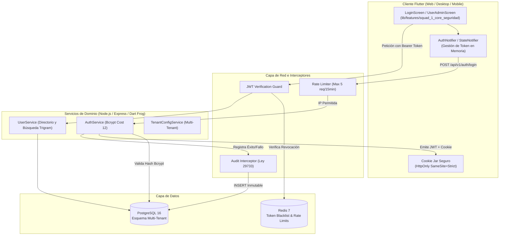
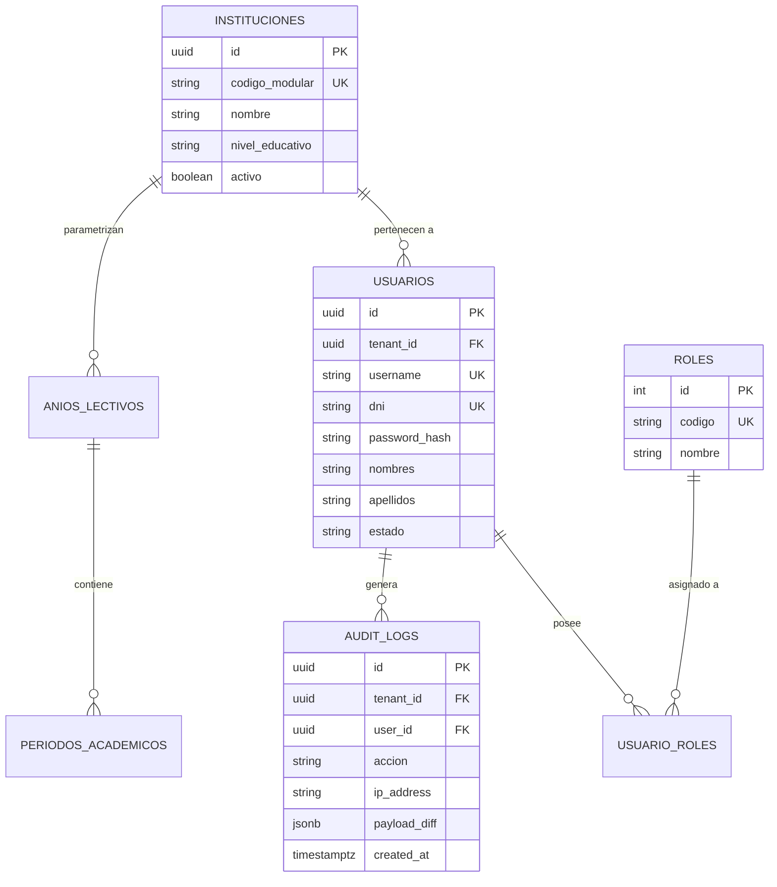

# Documento de Diseño de Software (SDD) — Squad 1: Core, Seguridad, Configuración y Auditoría

### Planteles de Aplicación "Guamán Poma de Ayala" — UNSCH
**Servicio Social Universitario IS-480 (2026-II)**  
**Estándar Normativo:** IEEE 1016-2009 / ISO/IEC/IEEE 42010

---

## Metadatos del Documento

| Campo | Detalle |
|---|---|
| **Squad Responsable** | Squad 1: Core, Seguridad, Configuración Institucional y Auditoría |
| **Líder Técnico** | Brandon Fernando Montero Gutiérrez (`@brandonmontero27-g`) |
| **Rama de Desarrollo** | `feature/squad-1/auth-core` |
| **Módulos Asignados** | Módulo 1 (Acceso y JWT), Módulo 2 (Usuarios), Módulo 3 (Configuración Escolar), Módulo 12 (Auditoría) |
| **Requisitos Trazables** | `RF-01` al `RF-14` y `RF-65` al `RF-68` (**18 Requisitos Funcionales**) |
| **Casos de Uso** | `CU-SEG-01`..`04`, `CU-USR-01`..`05`, `CU-INS-01`..`05`, `CU-AUD-01`..`04` (**18 Casos de Uso**) |
| **Versión del SDD** | v1.0.0 (Línea Base Fase 2) |
| **Estado** | Aprobado para Implementación |

---

## 1. Introducción y Alcance del Módulo

### 1.1. Propósito del Documento
El presente Documento de Diseño de Software (SDD) formaliza las decisiones de arquitectura técnica, el diseño de modelos relacionales en PostgreSQL, los contratos de endpoints RESTful y la estructura de componentes en Flutter correspondientes al núcleo de seguridad, administración multi-tenant y auditoría inmutable del Sistema de Gestión Escolar.

### 1.2. Alcance Funcional
* **Autenticación Robusta:** Emisión y rotación de tokens JWT duales (Access Token de 15 minutos en memoria y Refresh Token de 7 días en cookie segura `HttpOnly`).
* **Control de Acceso RBAC Granular:** Autorización por roles jerárquicos (`SUPERADMIN`, `DIRECTIVO`, `DOCENTE`, `ESTUDIANTE`, `PORTERIA`).
* **Gestión Multi-Tenant:** Aislamiento lógico de planteles y sedes por `tenant_id` en todas las consultas.
* **Configuración del Año Académico:** Parametrización de bimestres, calendarios y escalas CNEB.
* **Pista de Auditoría Inmutable:** Registro indeleble de accesos y modificaciones sensibles conforme a la Ley N.° 29733 (Protección de Datos Personales).

### 1.3. Supuestos y Restricciones Técnicas
* **Motor de Base de Datos:** PostgreSQL 16 con extensiones `uuid-ossp` y `pg_trgm`.
* **Caché y Rate-Limiting:** Redis 7 para lista negra de tokens revocados y bloqueo por intentos fallidos (máx. 5 intentos cada 15 min).
* **Frontend:** Flutter 3.35+ bajo arquitectura Feature-First en `lib/features/squad_1_core_seguridad/`.

---

## 2. Vista Arquitectural del Módulo (Modelo C4)

### 2.1. Diagrama de Contenedores y Flujo de Autenticación



### 2.2. Descripción de Componentes Principales

| Componente | Capa | Responsabilidad |
|---|---|---|
| `AuthNotifier` | Flutter Presentation | Controla el ciclo de vida de la sesión en el cliente y la renovación automática del Access Token. |
| `AuthMiddleware` | Backend Gateway | Intercepta peticiones protegidas, valida la firma HMAC-SHA256 del JWT y consulta Redis. |
| `AuditService` | Backend Domain | Construye el registro diferencial (payload JSONB) y ejecuta la inserción inmutable. |
| `instituciones` | PostgreSQL Data | Tabla raíz del modelo multi-tenant que particiona lógicamente los datos de las sedes escolares. |

---

## 3. Diseño Detallado de Persistencia (PostgreSQL)

### 3.1. Modelo Entidad-Relación de Seguridad y Core



### 3.2. Script DDL y Triggers de Inmutabilidad

```sql
-- Extensiones requeridas
CREATE EXTENSION IF NOT EXISTS "uuid-ossp";
CREATE EXTENSION IF NOT EXISTS "pg_trgm";

-- Tipos ENUM
CREATE TYPE rol_usuario_enum AS ENUM ('SUPERADMIN', 'DIRECTIVO', 'DOCENTE', 'ESTUDIANTE', 'PORTERIA');
CREATE TYPE estado_usuario_enum AS ENUM ('ACTIVO', 'INACTIVO', 'BLOQUEADO', 'PENDIENTE_CAMBIO_CLAVE');

-- 1. Tabla de Instituciones (Multi-Tenant)
CREATE TABLE IF NOT EXISTS instituciones (
    id UUID PRIMARY KEY DEFAULT uuid_generate_v4(),
    codigo_modular VARCHAR(10) NOT NULL UNIQUE,
    nombre VARCHAR(150) NOT NULL,
    nivel_educativo VARCHAR(50) NOT NULL,
    activo BOOLEAN DEFAULT TRUE,
    created_at TIMESTAMPTZ DEFAULT CURRENT_TIMESTAMP,
    updated_at TIMESTAMPTZ DEFAULT CURRENT_TIMESTAMP
);

-- 2. Tabla de Usuarios
CREATE TABLE IF NOT EXISTS usuarios (
    id UUID PRIMARY KEY DEFAULT uuid_generate_v4(),
    tenant_id UUID NOT NULL REFERENCES instituciones(id) ON DELETE RESTRICT,
    username VARCHAR(50) NOT NULL,
    dni CHAR(8) NOT NULL,
    email VARCHAR(100) NOT NULL,
    password_hash VARCHAR(255) NOT NULL,
    nombres VARCHAR(100) NOT NULL,
    apellidos VARCHAR(100) NOT NULL,
    estado estado_usuario_enum DEFAULT 'ACTIVO',
    created_at TIMESTAMPTZ DEFAULT CURRENT_TIMESTAMP,
    updated_at TIMESTAMPTZ DEFAULT CURRENT_TIMESTAMP,
    CONSTRAINT uq_usuario_tenant UNIQUE (tenant_id, username),
    CONSTRAINT uq_usuario_dni UNIQUE (tenant_id, dni)
);

CREATE INDEX idx_usuarios_tenant ON usuarios(tenant_id);
CREATE INDEX idx_usuarios_dni ON usuarios(dni);
CREATE INDEX idx_usuarios_nombres_trgm ON usuarios USING gin ((nombres || ' ' || apellidos) gin_trgm_ops);

-- 3. Tabla Inmutable de Auditoría (Ley 29733)
CREATE TABLE IF NOT EXISTS audit_logs (
    id UUID PRIMARY KEY DEFAULT uuid_generate_v4(),
    tenant_id UUID NOT NULL REFERENCES instituciones(id) ON DELETE RESTRICT,
    user_id UUID REFERENCES usuarios(id) ON DELETE SET NULL,
    accion VARCHAR(100) NOT NULL,
    entidad VARCHAR(50) NOT NULL,
    entidad_id UUID,
    ip_address VARCHAR(45) NOT NULL,
    user_agent TEXT,
    payload_diff JSONB,
    created_at TIMESTAMPTZ DEFAULT CURRENT_TIMESTAMP NOT NULL
);

-- Trigger de Inmutabilidad Estricta (Prohibido UPDATE y DELETE)
CREATE OR REPLACE FUNCTION fn_prevent_audit_tampering()
RETURNS TRIGGER AS $$
BEGIN
    RAISE EXCEPTION 'VIOLACIÓN DE SEGURIDAD (Ley 29733): Los registros de auditoría son estrictamente inmutables.';
END;
$$ LANGUAGE plpgsql;

CREATE TRIGGER trg_prevent_audit_update_delete
BEFORE UPDATE OR DELETE ON audit_logs
FOR EACH ROW EXECUTE FUNCTION fn_prevent_audit_tampering();
```

---

## 4. Contratos de Comunicación (API REST)

### 4.1. `POST /api/v1/auth/login` (Autenticación Principal)
* **Descripción:** Autentica al usuario institucional mediante credenciales seguras.
* **Seguridad:** Rate limiting activo (máx 5 intentos/15 min).

#### Request Body:
```json
{
  "tenantModularCode": "0382910",
  "username": "70859632",
  "password": "Password123!"
}
```

#### Response `200 OK`:
```json
{
  "success": true,
  "statusCode": 200,
  "data": {
    "accessToken": "eyJhbGciOiJIUzI1NiIsInR5cCI6IkpXVCJ9...",
    "expiresIn": 900,
    "user": {
      "id": "a0eebc99-9c0b-4ef8-bb6d-6bb9bd380a11",
      "dni": "70859632",
      "nombres": "Brandon Fernando",
      "apellidos": "Montero Gutiérrez",
      "roles": ["SUPERADMIN"],
      "tenantId": "f47ac10b-58cc-4372-a567-0e02b2c3d479"
    }
  }
}
```
* **Cookie en Cabecera:**  
  `Set-Cookie: refreshToken=eyJhbGci...; HttpOnly; Secure; SameSite=Strict; Max-Age=604800; Path=/api/v1/auth`

---

### 4.2. `POST /api/v1/auth/logout` (Revocación Inmediata)
* **Descripción:** Revoca el Refresh Token e introduce el Access Token en Redis Blacklist.

#### Response `200 OK`:
```json
{
  "success": true,
  "message": "Sesión cerrada satisfactoriamente y credenciales revocadas."
}
```

---

### 4.3. `GET /api/v1/users` (Directorio Institucional Paginado)
* **Headers:** `Authorization: Bearer <accessToken>`
* **Query Params:** `page=1&limit=20&role=DOCENTE&query=Montero`

#### Response `200 OK`:
```json
{
  "success": true,
  "data": {
    "items": [
      {
        "id": "a0eebc99-9c0b-4ef8-bb6d-6bb9bd380a11",
        "dni": "70859632",
        "nombres": "Brandon Fernando",
        "apellidos": "Montero Gutiérrez",
        "email": "bmontero@planteles.unsch.edu.pe",
        "roles": ["DOCENTE", "ADMIN"],
        "estado": "ACTIVO"
      }
    ],
    "meta": {
      "totalItems": 45,
      "currentPage": 1,
      "totalPages": 3
    }
  }
}
```

---

## 5. Diseño Frontend en Flutter (Feature-First)

### 5.1. Organización del Código

```text
lib/features/squad_1_core_seguridad/
├── presentation/
│   ├── screens/
│   │   ├── squad_1_screen.dart           # Dashboard maestro del Squad 1
│   │   ├── login_screen.dart             # Formulario de inicio de sesión reactivo
│   │   └── audit_viewer_screen.dart      # Visor paginado de bitácoras de auditoría
│   └── widgets/
│       ├── rbac_role_chip.dart           # Selector visual interactivo de roles
│       └── session_timer_widget.dart     # Contador regresivo de inactividad (30 min)
├── domain/
│   └── models/
│       ├── user_model.dart               # Entidad inmutable User
│       └── audit_log_entry.dart          # Entidad de registro de auditoría
├── data/
│   ├── datasources/
│   │   └── auth_remote_datasource.dart   # Cliente HTTP Dio con interceptor JWT
│   └── repositories/
│       └── auth_repository_impl.dart     # Implementación de repositorio
└── squad_1_core.dart                     # Barrel file de exportación pública
```

### 5.2. Manejo de Sesión y Expiración por Inactividad
* El cliente Flutter implementa un `GestureDetector` global que reinicia un temporizador de 30 minutos ante eventos táctiles o de teclado.
* Al minuto 29 sin actividad, despliega un diálogo de advertencia de 60 segundos antes del cierre forzoso.

---

## 6. Seguridad, Resiliencia y Atributos de Calidad (NFR)

* **Algoritmo Criptográfico de Contraseñas:** `bcrypt` con factor de coste 12.
* **Tiempos de Respuesta de API:**
  * Login / Logout: < 250 ms.
  * Búsqueda en directorio con índices trigrama: < 120 ms.
* **Protección de Datos Personales (Ley N.° 29733):**
  * DNIs y datos de menores de edad siempre enmascarados en reportes públicos.
  * Cifrado en reposo (AES-256) de campos sensibles.

---

## 7. Matriz de Trazabilidad Bidireccional

| Requisito | Caso de Uso | Tabla PostgreSQL | Endpoint API | Componente Flutter |
|---|---|---|---|---|
| `RF-01` | `CU-SEG-01` | `usuarios`, `instituciones` | `POST /auth/login` | `LoginScreen` |
| `RF-02` | `CU-SEG-02` | `Redis Blacklist` | `POST /auth/logout` | `SessionTimerWidget` |
| `RF-03` | `CU-SEG-03` | `usuarios` | `POST /auth/reset-password` | `ResetPasswordScreen` |
| `RF-04` | `CU-SEG-04` | `roles`, `usuario_roles` | `GET /roles`, `PUT /users/:id/roles` | `RbacRoleChip` |
| `RF-05` | `CU-USR-01` | `usuarios` | `POST /users` | `UserCreateDialog` |
| `RF-08` | `CU-USR-04` | `usuarios` (gin_trgm) | `GET /users?query=` | `UserDirectoryList` |
| `RF-10` | `CU-INS-01` | `anios_lectivos` | `POST /academic-years` | `AcademicYearConfigScreen` |
| `RF-11` | `CU-INS-02` | `periodos_academicos` | `POST /periods` | `PeriodTimelineWidget` |
| `RF-65` | `CU-AUD-01` | `audit_logs` | `POST /audit/logs` | `AuditInterceptor` |
| `RF-66` | `CU-AUD-02` | `audit_logs` | Trigger PostgreSQL | `AuditRowWidget` |
| `RF-67` | `CU-AUD-03` | `audit_logs` | `GET /audit/logs` | `AuditViewerScreen` |
| `RF-68` | `CU-AUD-04` | `audit_logs`, `usuarios` | Políticas de privacidad | `PrivacyPolicyDialog` |
