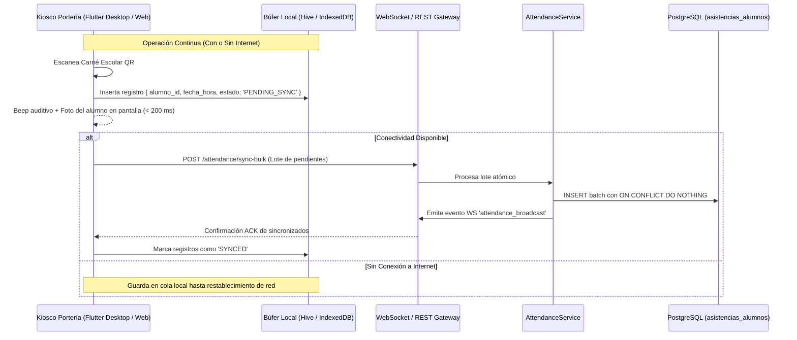

# SQUAD 2: Gestión Académica, Matrícula y Asistencia Offline-First

**Responsable Técnico:** Eduardo Sebastian Paipay Vega (`@Eduardo-Sebastian-Paipay-Vega`)  
**Rol:** Project Lead & Full-Stack Architect  
**Rama Git Principal:** `feature/squad-2/kiosk-attendance`  
**Total de Requisitos:** **21 Requisitos Funcionales**  

---

## 1. Módulos y Requisitos Asignados

### Módulo 4: Gestión Académica, Matrícula y Carga Lectiva (`RF-15` al `RF-19`)
* `RF-15`: Creación y Gestión de Grados y Secciones (capacidad máxima de aula, tutor asignado).
* `RF-16`: Matrícula Escolar Regular y Extraordinaria (asignación de estudiante a grado/sección con validación de edad y estado académico).
* `RF-17`: Catálogo Curricular y Planes de Estudio oficiales según normativa CNEB / MINEDU.
* `RF-18`: Asignación de Carga Lectiva Docente (vinculación de profesor con curso, grado y sección).
* `RF-19`: Gestión de Traslados, Retiros y Cambios de Sección con actualización de vacantes.

### Módulo 5: Asistencia Estudiantil, Kiosco Offline-First, App Rápida y Carnés QR (`RF-20` al `RF-27`)
* `RF-20`: Registro de Asistencia Diaria en Aula por Docente o Auxiliar (Presente, Tardanza, Falta Justificada, Falta Injustificada).
* `RF-21`: Justificación de Inasistencias con adjunto documental digital y validación directiva.
* `RF-22`: Alertas Tempranas de Inasistencias Consecutivas para Tutores y Padres de Familia.
* `RF-23`: Reportes Consolidados de Asistencia Escolar por Sección, Grado y Mes.
* `RF-24`: Cómputo Automático de Porcentaje de Inasistencias y límite reglamentario de inhabilitación (30% de faltas).
* `RF-25` *(Innovación 1)*: **Kiosco de Portería Resiliente Offline-First:** Interfaz para el personal de portería ("wachimán") con soporte de lectura de código de barras/QR, almacenamiento en búfer local (`IndexedDB` en Web / `Hive` en Desktop) ante cortes de internet y sincronización automática transaccional al reconectar.
* `RF-26` *(Innovación 2)*: **Generación Masiva de Carnés Escolares con QR:** Emisión e impresión en hojas A4 de carnés estudiantiles con fotografía, datos y código QR institucional de lectura rápida.
* `RF-27` *(Innovación 3)*: **Toma Rápida de Asistencia Móvil y Difusión en Tiempo Real:** Marcación táctil en 1 toque desde smartphones/tablets con transmisión inmediata a dirección y auxiliares vía WebSockets (< 500 ms).

### Módulo 6: Asistencia y Cómputo de Horas de Practicantes EPIS/UNSCH (`RF-28` al `RF-31`)
* `RF-28`: Registro de Entrada y Salida de Estudiantes en Prácticas Pre-Profesionales de la EPIS-UNSCH.
* `RF-29`: Asignación de Docente Guía / Asesor institucional en el colegio.
* `RF-30`: Cómputo Acumulado de Horas Pedagógicas y Administrativas para el Convenio UNSCH.
* `RF-31`: Emisión de Fichas de Cumplimiento de Prácticas con visto bueno del Director.

### Módulo 7: Horas de Docentes Contratados y Reprogramación (`RF-32` al `RF-35`)
* `RF-32`: Registro Biométrico/Manual de Asistencia para Docentes Contratados por Horas.
* `RF-33`: Consolidado Mensual de Horas Dictadas para sustento de planillas administrativas.
* `RF-34`: Registro y Aprobación de Reprogramación de Clases y Recuperación de Sesiones.
* `RF-35`: Detección de Cruces de Horario y Aulas en la asignación docente.

---

## 2. Arquitectura Técnica del Kiosco Offline-First y WebSockets

---

## 3. Modelo de Datos a Implementar (PostgreSQL)

Tablas principales a estructurar en las migraciones:
1. `grados_secciones` (`id`, `tenant_id`, `nivel`, `grado`, `seccion`, `capacidad_maxima`, `tutor_id`)
2. `cursos` (`id`, `nombre`, `area_curricular`, `horas_semanales`, `grado`)
3. `matriculas` (`id`, `estudiante_id`, `seccion_id`, `anio_lectivo_id`, `estado`, `fecha_matricula`)
4. `carga_docente` (`id`, `docente_id`, `curso_id`, `seccion_id`, `anio_lectivo_id`)
5. `asistencias_alumnos` (`id`, `matricula_id`, `fecha`, `hora_ingreso`, `estado`, `origen`, `justificada`)
6. `carnes_escolares` (`id`, `estudiante_id`, `codigo_qr_token`, `fecha_emision`, `activo`)
7. `asistencias_practicantes` (`id`, `practicante_id`, `fecha`, `hora_entrada`, `hora_salida`, `horas_computadas`, `actividad`)
8. `asistencias_docentes_contratados` (`id`, `docente_id`, `fecha`, `horas_dictadas`, `tema_sesion`, `reprogramacion`)

---

## 4. Endpoints y Contratos API a Desarrollar

* `POST /api/v1/enrollment` (matricula masiva e individual)
* `POST /api/v1/attendance/kiosk/scan` (recepción de marcación individual directa)
* `POST /api/v1/attendance/sync-bulk` (sincronización por lotes desde el Kiosco Offline)
* `WS   /ws/attendance/live` (canal WebSocket para actualización inmediata en dirección de ingresos escolares)
* `GET  /api/v1/attendance/section/:id/daily` (asistencia de aula para profesores)
* `POST /api/v1/attendance/student-cards/generate-pdf` (generador de pliego de carnés QR)
* `GET  /api/v1/practicantes/report-hours` (cómputo acumulado de prácticas pre-profesionales)

---

## 5. Componentes y Vistas Frontend (Flutter)

* `lib/features/academic_management/presentation/pages/enrollment_page.dart` (Asignación rápida de alumnos a vacantes).
* `lib/features/attendance_kiosk/presentation/pages/kiosk_screen.dart` (Interfaz a pantalla completa de portería, retroalimentación sonora verde/rojo, visualización de foto del alumno y estado de sincronización de la cola offline).
* `lib/features/attendance_kiosk/presentation/pages/mobile_quick_attendance_page.dart` (App móvil con lista de estudiantes y chips táctiles de 1 toque: Presente / Tardanza / Falta).
* `lib/features/attendance_kiosk/presentation/pages/student_cards_print_page.dart` (Previsualizador de hoja A4 con diseño oficial de carnés escolares y código QR).
* `lib/features/attendance_staff/presentation/pages/practicantes_tracking_page.dart` (Control de horas de los alumnos EPIS-UNSCH).

---

## 6. Criterios de Aceptación (Definition of Done)
1. El Kiosco de portería no se bloquea ni pierde ninguna marcación cuando se desconecta el cable de red o WiFi.
2. Al volver la conexión, los registros del búfer se suben automáticamente sin duplicarse (`idempotencia`).
3. La toma de asistencia de aula se propaga a los dashboards de dirección en menos de 500 ms vía WebSockets.
4. Los carnés escolares en PDF contienen códigos QR válidos que son reconocidos inmediatamente por el lector de portería.
