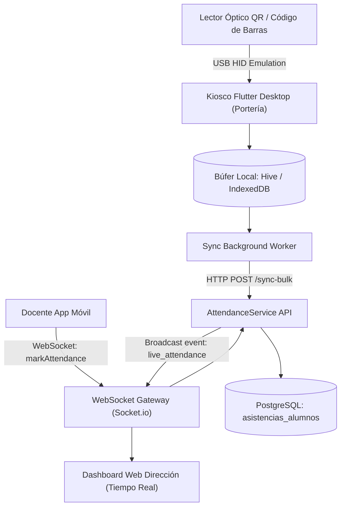

# Arquitectura Técnica: Kiosco Offline-First, WebSockets y Matrícula

**Squad:** Squad 2 - Matricula y Asistencia  
**Líder Técnico:** Eduardo Sebastian Paipay Vega (`@Eduardo-Sebastian-Paipay-Vega`)  
**Rama de Desarrollo:** `feature/squad-2/kiosk-attendance`  
**Requisitos Asociados:** [`Fase 2/Requisitos Funcionales/Squad 2 - Matricula y Asistencia/`](../../Requisitos%20Funcionales/Squad%202%20-%20Matricula%20y%20Asistencia/README.md) (`RF-15` al `RF-35`)  

---

## 1. Patrones de Diseño y Decisiones Arquitectónicas (ADRs)

1. **Arquitectura Offline-First para Kiosco de Portería:**
   * Almacenamiento local en `Hive` (Flutter Desktop) o `IndexedDB` (Flutter Web).
   * Cuando se escanea un carné QR, la transacción se persiste localmente en menos de 50 ms en estado `PENDING_SYNC` y se reproduce un pitido/feedback visual inmediato para no detener el flujo peatonal en la puerta.
2. **Sincronización por Lotes Eventual (Batch Sync):**
   * Un servicio en segundo plano monitorea la conectividad (`connectivity_plus`).
   * Al detectar red, envía paquetes de 50 registros vía `POST /attendance/sync-bulk`.
   * El backend aplica inserción atómica idempotente con cláusula `ON CONFLICT (matricula_id, fecha, turno) DO NOTHING`.
3. **Difusión en Tiempo Real vía WebSockets:**
   * Servidor WebSockets (Socket.io) emite eventos en tiempo real cuando un docente marca asistencia en aula desde la App Móvil (`attendance_classroom_marked`).
   * Las pantallas de dirección y auxiliares reciben la actualización en menos de 500 ms sin refrescar página.

---

## 2. Diagrama de Componentes C4 (Kiosco Offline y WebSockets)

---

## 3. Artefactos Técnicos en este Directorio
* 📄 **[esquema_datos.sql](esquema_datos.sql)**: DDL de matrículas, asistencias, carnés escolares y tracking de practicantes/docentes.
* 📄 **[contratos_api.md](contratos_api.md)**: Endpoints de sincronización en lote, marcación de kiosco y eventos de WebSocket.
