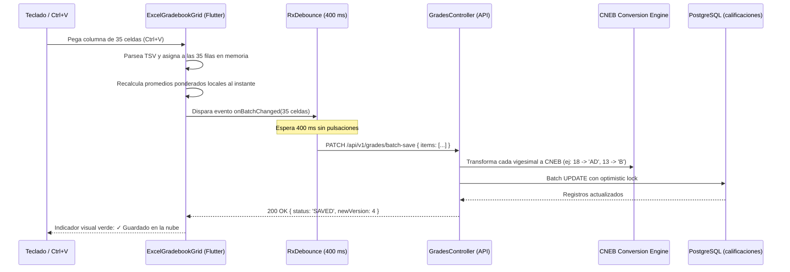

# Arquitectura Técnica: Planilla Matricial Modo Excel y Motor CNEB

**Squad:** Squad 3 - Calificaciones y Modo Excel  
**Líder Técnico:** Steve Smith Ovalle Luyo (`@steveovalle27-lgtm`)  
**Rama de Desarrollo:** `feature/squad-3/gradebook-excel`  
**Requisitos Asociados:** [`Fase 2/Requisitos Funcionales/Squad 3 - Calificaciones y Modo Excel/`](../../Requisitos%20Funcionales/Squad%203%20-%20Calificaciones%20y%20Modo%20Excel/README.md) (`RF-36` al `RF-46`)  

---

## 1. Patrones de Diseño y Decisiones Arquitectónicas (ADRs)

1. **Componente Matricial Optimizado ("Modo Excel"):**
   * Grid reactivo virtualizado en Flutter que renderiza únicamente las celdas visibles en pantalla.
   * Manejador de focos customizado (`FocusNode`) que intercepta teclas de dirección (flechas), Tab y Enter para desplazamiento bidireccional instantáneo sin retrasos de renderizado.
2. **Parser de Portapapeles para Pegado Masivo (Ctrl+V):**
   * Intercepta la combinación de teclas en Flutter, extrae el texto del portapapeles del sistema operativo, parsea la matriz separada por tabulaciones (`\t`) y saltos de línea (`\n`), y mapea los valores masivamente sobre las filas de alumnos.
3. **Auto-Guardado en Segundo Plano con Debounce (400 ms):**
   * Cada digitación inicia un temporizador de 400 ms. Si el docente continúa digitando, el timer se reinicia.
   * Al detenerse, emite una petición HTTP PATCH por lotes con bloqueo optimista (`version_lock`), cambiando el icono superior a verde: *"Guardado en la nube"*.
4. **Motor de Conversión Dual Escala Vigesimal a Literal CNEB:**
   * Persistencia dual en base de datos: columna numérica `nota_vigesimal` (NUMERIC(4,2)) para cálculos estadísticos y columna textual `nota_literal` (VARCHAR(2)) oficial MINEDU (AD, A, B, C).

---

## 2. Diagrama de Secuencia: Auto-Guardado y Pegado Masivo

---

## 3. Artefactos Técnicos en este Directorio
* 📄 **[esquema_datos.sql](esquema_datos.sql)**: DDL de evaluaciones, criterios de rúbricas, calificaciones duales y conclusiones descriptivas.
* 📄 **[contratos_api.md](contratos_api.md)**: Endpoints de guardado por lotes, matriz de notas y banco taxonómico CNEB.
