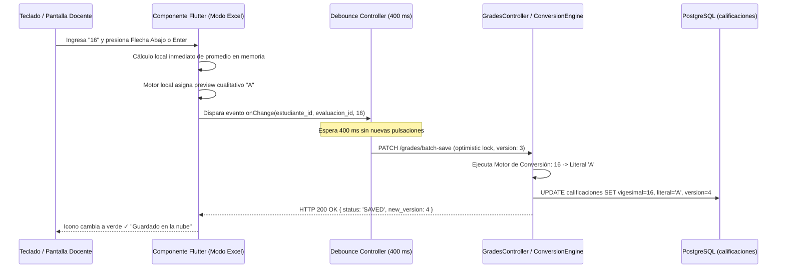

# SQUAD 3: Evaluación Pedagógica, Planilla Rápida y Motor CNEB

**Responsable Técnico:** Steve Smith Ovalle Luyo (`@steveovalle27-lgtm`)  
**Rol:** Sub Líder / UX & Real-Time Engine Specialist  
**Rama Git Principal:** `feature/squad-3/gradebook-excel`  
**Total de Requisitos:** **11 Requisitos Funcionales** *(Núcleo de Innovación y Máxima Usabilidad Docente)*  

---

---

## 📁 Documentación y Alcance Técnico del Squad

1. 📄 **[Catálogo de Requisitos Funcionales del Squad](../../Requisitos%20Funcionales/Squad%203%20-%20Calificaciones%20y%20Modo%20Excel/README.md)**: Especificación individual de los 11 Requisitos Funcionales asignados (ubicados en `Fase 2/Requisitos Funcionales/Squad 3 - Calificaciones y Modo Excel/`).
2. 🛠️ **[Diseño Técnico de Software](Diseno%20Tecnico/README.md)**: Arquitectura técnica interna, modelo de datos relacional (PostgreSQL), endpoints API REST, WebSockets y diseño de componentes Flutter.

## 1. Módulos y Requisitos Asignados

### Módulo 8: Calificaciones en Tiempo Real, Modo Excel, Auto-Guardado y Conversión CNEB (`RF-36` al `RF-46`)
* `RF-36`: Configuración de Criterios y Rúbricas de Evaluación por Competencias y Capacidades curriculares.
* `RF-37`: Registro de Calificaciones en Tiempo Real con cálculo inmediato de promedios ponderados y visuales de aprobación.
* `RF-38` *(Innovación 4)*: **Planilla Rápida de Notas ("Modo Excel"):** Componente matricial de alta eficiencia en Flutter con navegación completa por teclado (flechas arriba/abajo/izquierda/derecha, tecla Tab para siguiente casilla, Enter para confirmar), edición inline ultra-ágil y pegado matricial masivo (Ctrl+V) desde Microsoft Excel o Google Sheets.
* `RF-39` *(Innovación 5)*: **Asistente de Conclusiones Descriptivas CNEB/MINEDU:** Banco taxonómico estructurado de retroalimentaciones pedagógicas contextualmente sugeridas según el nivel de logro del estudiante (AD, A, B o C), con posibilidad de personalización docente en 1 clic.
* `RF-40`: Soporte y Supervisión de Notas Registradas por Practicantes EPIS (requiere visto bueno o validación del docente titular).
* `RF-41`: Ponderación y Cálculo Automatizado de Promedios Bimestrales / Trimestrales según fórmula configurada.
* `RF-42`: Bloqueo y Cierre Formal de Periodo Académico (congelamiento de notas que impide modificaciones sin autorización de dirección).
* `RF-43`: Consulta en Tiempo Real de Calificaciones para Estudiantes y Padres de Familia desde el portal/app.
* `RF-44`: Historial de Modificaciones de Calificaciones (registro de docente, valor anterior, valor nuevo, motivo y fecha/hora).
* `RF-45` *(Innovación 6)*: **Llenado Asistido con Auto-Guardado en Segundo Plano:** Persistencia transparente con temporizador `debounce` de 400 ms, sin botones de "Guardar" que interrumpan al docente, indicador visual de sincronización en tiempo real ("Guardando..." / "Guardado en la nube") y prevención de pérdidas ante cierres accidentales.
* `RF-46` *(Innovación 7)*: **Motor de Conversión Dual Escala Vigesimal (0-20) a CNEB (AD, A, B, C):** Transformación algorítmica automatizada de valores numéricos a la escala cualitativa oficial del Ministerio de Educación, con almacenamiento dual en base de datos para preservar la precisión analítica y cumplir con el formato oficial del SIAGIE.

---

## 2. Arquitectura de la Planilla Rápida y Auto-Guardado Concurrente

---

## 3. Modelo de Datos a Implementar (PostgreSQL)

Tablas principales a estructurar en las migraciones:
1. `evaluaciones` (`id`, `carga_docente_id`, `periodo_id`, `nombre`, `peso`, `fecha`, `cerrada`)
2. `criterios_rubricas` (`id`, `evaluacion_id`, `descripcion`, `peso_porcentual`)
3. `calificaciones` (`id`, `matricula_id`, `evaluacion_id`, `nota_vigesimal` NUMERIC(4,2), `nota_literal` VARCHAR(2), `version_lock` INT, `updated_at`, `updated_by`)
4. `conclusiones_descriptivas` (`id`, `matricula_id`, `curso_id`, `periodo_id`, `texto_conclusion`, `es_sugerida_banco`)
5. `banco_conclusiones_cneb` (`id`, `competencia_id`, `nivel_logro` ENUM('AD','A','B','C'), `texto_plantilla`)
6. `historial_cambios_notas` (`id`, `calificacion_id`, `nota_antigua`, `nota_nueva`, `justificacion`, `autorizado_por`, `created_at`)

---

## 4. Endpoints y Contratos API a Desarrollar

* `GET  /api/v1/grades/matrix` (params: `cargaDocenteId`, `periodoId` -> devuelve matriz de estudiantes x evaluaciones)
* `PATCH /api/v1/grades/batch-save` (body: array de `{ calificacionId, matriculaId, evaluacionId, nota, versionLock }`)
* `POST /api/v1/grades/convert-scale` (validador y conversor vigesimal <-> CNEB)
* `GET  /api/v1/cneb/conclusions-bank` (params: `competenciaId`, `nivelLogro` -> devuelve banco sugerido)
* `POST /api/v1/grades/periods/:id/lock` (cierre formal de periodo con bloqueo de edición)
* `GET  /api/v1/grades/student/:matriculaId/report` (vista de calificaciones para alumnos/apoderados)

---

## 5. Componentes y Vistas Frontend (Flutter)

* `lib/features/gradebook_excel/presentation/pages/excel_gradebook_screen.dart` (Planilla matricial completa con cabeceras de columnas congeladas y columna de estudiantes fija).
* `lib/features/gradebook_excel/presentation/widgets/keyboard_accessible_cell.dart` (Celda con focus node personalizado para navegación por flechas de dirección, Tab y Enter).
* `lib/features/gradebook_excel/presentation/widgets/clipboard_paste_handler.dart` (Parser de texto tabulado TSV/CSV para pegar rangos de celdas desde Excel).
* `lib/features/gradebook_excel/presentation/widgets/conclusions_assistant_modal.dart` (Selector inteligente de frases CNEB clasificadas por nivel AD, A, B, C con inserción directa).
* `lib/features/gradebook_excel/presentation/widgets/save_status_indicator.dart` (Indicador animado de estado de sincronización en la barra superior).

---

## 6. Criterios de Aceptación (Definition of Done)
1. Un docente puede llenar las notas de 35 estudiantes usando **exclusivamente el teclado** sin tocar el mouse.
2. Al pegar una columna de 30 celdas copiadas de Excel (Ctrl+C / Ctrl+V), el componente las distribuye en las filas correctas y las guarda en segundo plano.
3. El motor de conversión dual almacena con precisión tanto el número decimal como la letra correspondiente del MINEDU.
4. Una vez cerrada el acta bimestral, las celdas se bloquean visualmente y el backend rechaza cualquier modificación.
