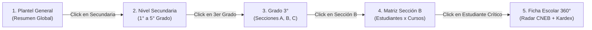

# Arquitectura Técnica: Mapas de Calor Jerárquicos y Dashboards 360°

**Squad:** Squad 4 - Analitica y Dashboards  
**Líder Técnico:** Grissel Arascely Rodríguez Quispe (`@Arascely`)  
**Rama de Desarrollo:** `feature/squad-4/heatmaps-dashboards`  
**Requisitos Asociados:** [`Fase 2/Requisitos Funcionales/Squad 4 - Analitica y Dashboards/`](../../Requisitos%20Funcionales/Squad%204%20-%20Analitica%20y%20Dashboards/README.md) (`RF-47` al `RF-58`)  

---

## 1. Patrones de Diseño y Decisiones Arquitectónicas (ADRs)

1. **Navegación Interactiva Drill-Down por Niveles Jerárquicos:**
   * La visualización térmica no recarga la página; mediante un gestor de estados jerárquico navega:
     * **Nivel 1 (Macro):** Todo el colegio (Inicial / Primaria / Secundaria).
     * **Nivel 2 (Meso):** Grado escolar (comparativa de rendimiento entre secciones A, B, C).
     * **Nivel 3 (Micro):** Sección (mapa de calor por estudiante vs áreas curriculares).
     * **Nivel 4 (Individual):** Ficha 360° del Estudiante con gráfico de radar de competencias CNEB.
2. **Vistas Materializadas de Alto Rendimiento en PostgreSQL:**
   * Las agregaciones estadísticas de notas y ausentismo se precalculan en vistas materializadas (`vm_rendimiento_seccion`, `vm_asistencia_mensual`) que se refrescan concurrentemente (`REFRESH MATERIALIZED VIEW CONCURRENTLY`) cada 30 minutos o al cierre de periodo.
3. **Algoritmo Predictivo de Detección de Abandono Escolar:**
   * Factor de riesgo normalizado de 0 a 100:  
     $$R = (0.55 \cdot \% 	ext{Inasistencias}) + (0.35 \cdot \% 	ext{Cursos Desaprobados}) + (0.10 \cdot 	ext{Tardanzas})$$
   * Si $R \ge 60$, el estudiante se cataloga automáticamente en **"Riesgo Crítico"** y se notifica al tutor.

---

## 2. Diagrama de Flujo de Navegación Drill-Down

---

## 3. Artefactos Técnicos en este Directorio
* 📄 **[esquema_datos.sql](esquema_datos.sql)**: Vistas materializadas analíticas y tablas de seguimiento del SSU IS-480.
* 📄 **[contratos_api.md](contratos_api.md)**: Endpoints para datos de mapas de calor, Ficha 360° y tablero SSU.
