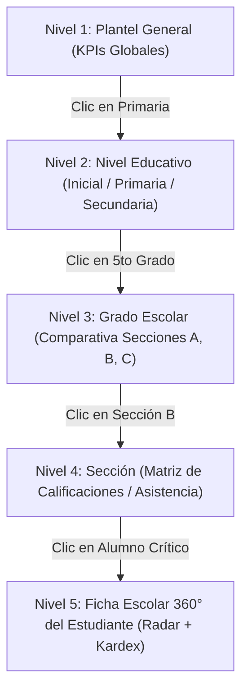

# SQUAD 4: Inteligencia de Datos, Mapas de Calor y Dashboards 360°

**Responsable Técnico:** Grissel Arascely Rodríguez Quispe (`@Arascely`)  
**Rol:** Frontend & Data Visualization Lead / UX Specialist  
**Rama Git Principal:** `feature/squad-4/heatmaps-dashboards`  
**Total de Requisitos:** **12 Requisitos Funcionales** *(Núcleo Analítico y Acreditación Universitaria)*  

---

## 📁 Carpetas de Trabajo de este Squad

Para organizar el desarrollo y la entrega técnica, este squad cuenta con dos carpetas operativas:

1. 📄 **[Requisitos/](Requisitos/README.md)**: Contiene la **documentación individual en archivos .md de cada Requisito Funcional** asignado (enunciado normativo, entradas, procesos, salidas y criterios de aceptación Gherkin).
2. 🛠️ **[Diseno Tecnico/](Diseno%20Tecnico/README.md)**: Contiene el **diseño técnico de software**, arquitectura de datos relacional (PostgreSQL), endpoints API REST, WebSockets y diseño de componentes Flutter.

## 1. Módulos y Requisitos Asignados

### Módulo 9: Mapas de Calor con Navegación Drill-Down (`RF-47` al `RF-51`)
* `RF-47`: Mapa de Calor Institucional de Rendimiento Académico (distribución cromática de promedios por áreas y bimestres: verde = logro destacado, amarillo = regular, rojo = en riesgo).
* `RF-48`: Mapa de Calor de Asistencia Escolar e Inasistencias (patrones visuales por días de la semana, meses y horarios).
* `RF-49` *(Innovación 8)*: **Mapas de Calor con Navegación Jerárquica Drill-Down:** Interfaz interactiva donde el director o coordinador hace clic en un bloque de calor para profundizar progresivamente: Nivel Institucional ➔ Nivel Primaria/Secundaria ➔ Grado ➔ Sección específica ➔ Lista detallada de estudiantes en riesgo.
* `RF-50`: Comparativa Visual de Rendimiento entre Secciones paralelas (análisis de varianza y homogeneidad pedagógica).
* `RF-51`: Exportación de Gráficos y Mapas Térmicos en formatos vectoriales e imágenes de alta resolución (PNG, PDF) para informes de gestión.

### Módulo 10: Dashboards, Ficha 360° del Alumno y Métricas SSU IS-480 (`RF-52` al `RF-58`)
* `RF-52`: Dashboard Ejecutivo para la Dirección General (KPIs globales de matrícula, asistencia del día, morosidad documental y estado de cierres).
* `RF-53`: Dashboard Operativo para Docentes (resumen de sesiones del día, cursos a cargo, actas pendientes de firma).
* `RF-54`: Dashboard Estudiantil / Padres de Familia (avance de notas, récord de asistencia, avisos escolares).
* `RF-55`: Alertas Automatizadas y Predictivas de Deserción Escolar (motor de detección por combinación de inasistencias reiteradas y caídas abruptas de notas).
* `RF-56` *(Innovación 9)*: **Ficha Escolar Integral y Radiografía 360° del Estudiante:** Vista consolidada del alumno que integra en un solo clic su historial académico completo, gráfica de radar de competencias CNEB, récord histórico de asistencia/tardanzas, observaciones de conducta y antecedentes de tutoría.
* `RF-57` *(Innovación 10)*: **Tablero de Seguimiento, Impacto y Acreditación del Servicio Social Universitario (SSU - IS-480):** Panel exclusivo para el Docente Tutor de la UNSCH y la Comisión Académica de la EPIS que muestra en tiempo real los indicadores de acreditación: tasa de adopción de la plataforma en el colegio (meta ≥ 80%), horas de trabajo administrativo ahorradas, actas digitales generadas y el registro cronológico del cumplimiento de las 96 horas de servicio de los 5 integrantes del equipo.
* `RF-58`: Generador de Reportes de Diagnóstico Integral para Consejos Académicos y Reuniones de Padres de Familia.

---

## 2. Arquitectura de Navegación Drill-Down y Agregaciones

---

## 3. Modelo de Datos a Implementar (PostgreSQL)

Vistas materializadas y consultas analíticas de alto rendimiento:
1. `vm_rendimiento_seccion` (cálculo preagregado de notas promedio por curso, sección y periodo).
2. `vm_asistencia_mensual` (porcentajes de asistencia, tardanzas y faltas agrupadas por grado/sección).
3. `vm_alertas_desercion` (cálculo de índice de riesgo $R = 0.6 \cdot (\% \text{faltas}) + 0.4 \cdot (\text{cursos desaprobados})$).
4. `metricas_impacto_ssu` (`id`, `integrante_equipo`, `horas_acumuladas`, `modulo_contribuido`, `fecha_registro`, `evidencia_url`).
5. `kpis_adopcion_colegio` (`id`, `fecha`, `docentes_activos`, `alumnos_consultados`, `boletas_emitidas`, `porcentaje_adopcion`).

---

## 4. Endpoints y Contratos API a Desarrollar

* `GET  /api/v1/analytics/heatmaps/grades` (params: `level`, `yearId`, `periodId` -> matriz de calor)
* `GET  /api/v1/analytics/heatmaps/drilldown` (params: `scope`, `targetId` -> datos del siguiente nivel jerárquico)
* `GET  /api/v1/students/:id/profile-360` (retorna kardex histórico, gráfico de radar CNEB y alertas)
* `GET  /api/v1/analytics/early-warning/dropouts` (lista de estudiantes con factor de riesgo > umbral)
* `GET  /api/v1/ssu-impact/accreditation-dashboard` (panel institucional de cumplimiento de las 96 horas y meta ≥ 80%)

---

## 5. Componentes y Vistas Frontend (Flutter)

* `lib/features/analytics_heatmaps/presentation/pages/heatmap_screen.dart` (Visualizador cromático interactivo con paleta accesible para daltonismo y transiciones animadas entre niveles).
* `lib/features/dashboards_360/presentation/pages/student_360_page.dart` (Ficha integral del estudiante con gráfico de radar de competencias de Flutter Charts).
* `lib/features/dashboards_360/presentation/pages/early_warning_page.dart` (Bandeja de alerta temprana con tarjetas semafóricas de estudiantes en riesgo).
* `lib/features/dashboards_360/presentation/pages/ssu_accreditation_dashboard_page.dart` (Tablero institucional para la UNSCH con velocímetros de adopción y barras de horas acumuladas).
* `lib/features/dashboards_360/presentation/widgets/kpi_card_widget.dart` (Tarjetas ejecutivas de resumen para dirección).

---

## 6. Criterios de Aceptación (Definition of Done)
1. Los mapas de calor responden a la interacción del usuario sin congelar la pantalla, navegando entre niveles en menos de 300 ms.
2. La Ficha 360° consolida en una sola pantalla todos los datos académicos y de conducta del estudiante.
3. El sistema identifica automáticamente a cualquier estudiante que supere el 20% de inasistencias o tenga más de 2 cursos en rojo.
4. El Tablero SSU refleja fielmente las horas de trabajo del equipo y calcula el porcentaje de adopción escolar.
