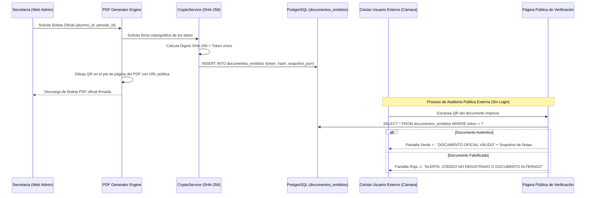

# Arquitectura Técnica: Criptografía SHA-256, Reportes PDF y Portal Web

**Squad:** Squad 5 - Secretaria y Portal Web  
**Líder Técnico:** Cesar Antonio Leon Reyna (`@cesarleon27-ai`)  
**Rama de Desarrollo:** `feature/squad-5/reports-crypto`  
**Requisitos Asociados:** [`Fase 2/Requisitos Funcionales/Squad 5 - Secretaria y Portal Web/`](../../Requisitos%20Funcionales/Squad%205%20-%20Secretaria%20y%20Portal%20Web/README.md) (`RF-59` al `RF-64`, `RF-69` al `RF-71`)  

---

## 1. Patrones de Diseño y Decisiones Arquitectónicas (ADRs)

1. **Sello Criptográfico Inmutable Anti-Falsificación (SHA-256 + QR):**
   * Cada boleta, certificado o acta oficial genera un digest criptográfico SHA-256 derivado de: `SHA-256(alumno_id + periodo_id + notas_json + fecha_emision + secret_key)`.
   * El hash y un token aleatorio único de 32 caracteres se guardan en `documentos_emitidos`.
   * El PDF incrusta un código QR con enlace público a: `https://planteles.unsch.edu.pe/verify?t=<TOKEN>`.
2. **Verificación Pública Ultra-Ligera sin Autenticación:**
   * Página web pública accesible desde cualquier navegador móvil/desktop sin requerir usuario ni contraseña.
   * Al escanear el QR, el endpoint valida la legitimidad y renderiza las notas oficiales emitidas, desenmascarando cualquier adulteración física del papel impreso.
3. **Generación de PDFs en Streaming:**
   * Motor de plantillas PDF para generación masiva en background con empaquetado automático en archivos ZIP para secretaría.

---

## 2. Diagrama de Arquitectura: Verificación Documental Criptográfica

---

## 3. Artefactos Técnicos en este Directorio
* 📄 **[esquema_datos.sql](esquema_datos.sql)**: DDL de documentos emitidos, tokens criptográficos, cuadros de mérito y comunicados.
* 📄 **[contratos_api.md](contratos_api.md)**: Endpoints de emisión documental, endpoint público de verificación QR y cartelera escolar.
