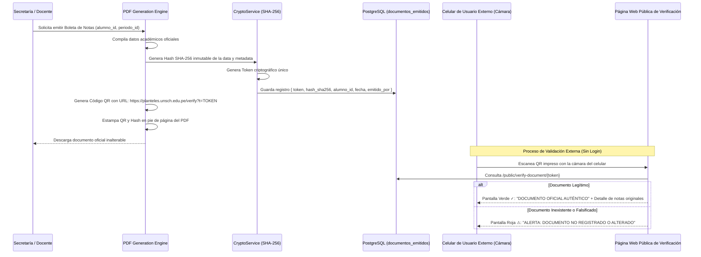

# SQUAD 5: Secretaría Digital, Criptografía Documental y Portal Web

**Responsable Técnico:** Cesar Antonio Leon Reyna (`@cesarleon27-ai`)  
**Rol:** Full-Stack Developer & Document Security Specialist  
**Rama Git Principal:** `feature/squad-5/reports-crypto`  
**Total de Requisitos:** **9 Requisitos Funcionales** *(Anti-Falsificación y Cara Pública del Colegio)*  

---

## 📁 Carpetas de Trabajo de este Squad

Para organizar el desarrollo y la entrega técnica, este squad cuenta con dos carpetas operativas:

1. 📄 **[Requisitos/](Requisitos/README.md)**: Contiene la **documentación individual en archivos .md de cada Requisito Funcional** asignado (enunciado normativo, entradas, procesos, salidas y criterios de aceptación Gherkin).
2. 🛠️ **[Diseno Tecnico/](Diseno%20Tecnico/README.md)**: Contiene el **diseño técnico de software**, arquitectura de datos relacional (PostgreSQL), endpoints API REST, WebSockets y diseño de componentes Flutter.

## 1. Módulos y Requisitos Asignados

### Módulo 11: Emisión de Reportes y Verificación Criptográfica QR (`RF-59` al `RF-64`)
* `RF-59`: Emisión Masiva y Descarga de Boletas de Calificaciones Oficiales en PDF con formato institucional normalizado.
* `RF-60` *(Innovación 11)*: **Verificación Pública Criptográfica de Documentos Escolares mediante Código QR:** Incrustación automática en el pie de página de toda boleta, constancia o certificado oficial emitido en PDF de un código QR único vinculado a un sello criptográfico inmutable (Hash SHA-256). Cualquier institución, universidad o apoderado puede escanear el papel impreso con la cámara de su celular y abrir una página pública del colegio que confirma al instante si el documento es auténtico y no ha sido alterado.
* `RF-61`: Cuadro de Mérito y Ranking Académico Automatizado por grado y sección (cálculo de orden de mérito conforme a directivas de evaluación).
* `RF-62`: Generación de Actas Oficiales Consolidadas de Fin de Periodo Escolar con firma digital/digitalizada de autoridades.
* `RF-63`: Exportación Masiva de Registros Auxiliares a Formato Microsoft Excel (.xlsx compatible con plantillas SIAGIE).
* `RF-64`: Certificados de Estudios, Constancias de Matrícula y de Conducta autogenerables con sello de agua y código único de trámite.

### Módulo 13: Plataforma de Difusión Digital y Portal Institucional (`RF-69` al `RF-71`)
* `RF-69`: Cartelera Digital Escolar y Módulo de Comunicados Institucionales para la comunidad educativa (padres, estudiantes, docentes).
* `RF-70`: Calendario Cívico Escolar y Cronograma de Actividades Extracurriculares (aniversario del colegio, desfiles, ferias de ciencias).
* `RF-71`: Portal Web Institucional Público y Responsive (presentación institucional, historia de los planteles, plana docente, admisión y buzón de consultas).

---

## 2. Arquitectura de Verificación Criptográfica SHA-256 + QR

---

## 3. Modelo de Datos a Implementar (PostgreSQL)

Tablas principales a estructurar en las migraciones:
1. `documentos_emitidos` (`id`, `tenant_id`, `tipo_documento`, `estudiante_id`, `token_verificacion` VARCHAR(64) UNIQUE, `hash_sha256` VARCHAR(64), `metadata_academica_json`, `emitido_por`, `created_at`)
2. `cuadros_merito` (`id`, `periodo_id`, `grado_seccion_id`, `estudiante_id`, `puesto`, `promedio_ponderado`)
3. `comunicados_cartelera` (`id`, `tenant_id`, `titulo`, `contenido`, `publico_objetivo`, `fecha_publicacion`, `fecha_expiracion`, `archivo_adjunto_url`)
4. `calendario_civico_eventos` (`id`, `titulo`, `fecha_evento`, `tipo_actividad`, `responsable_comision`, `descripcion`)
5. `publicaciones_portal` (`id`, `titulo`, `resumen`, `cuerpo`, `imagen_portada_url`, `categoria`, `publicado`)

---

## 4. Endpoints y Contratos API a Desarrollar

* `POST /api/v1/documents/report-card/generate-batch` (emisión de boletas de una sección completa)
* `GET  /api/v1/documents/merit-table` (params: `sectionId`, `periodId` -> ranking calculado)
* `GET  /api/v1/public/verify-document/:token` (endpoint público sin autenticación con rate-limiting estricto)
* `GET  /api/v1/portal/notices` (comunicados visibles en la cartelera digital)
* `GET  /api/v1/portal/civic-calendar` (eventos cívicos del mes)
* `POST /api/v1/documents/export-excel/siagie` (generador de Excel idéntico al estándar SIAGIE)

---

## 5. Componentes y Vistas Frontend (Flutter / Web Pública)

* `lib/features/reports_verification/presentation/pages/report_cards_generation_page.dart` (Bandeja de secretaría para emitir, previsualizar y descargar PDFs individuales o en lote comprimido ZIP).
* `lib/features/reports_verification/presentation/pages/public_verification_page.dart` (Página pública ultra-rápida y ligera para móviles que muestra el sello de autenticidad y las calificaciones originales).
* `lib/features/reports_verification/presentation/pages/merit_table_page.dart` (Visualizador de cuadros de mérito con podio visual de primeros puestos).
* `lib/features/public_portal/presentation/pages/institutional_portal_page.dart` (Portal web oficial de los planteles con diseño moderno, responsive y accesible).
* `lib/features/public_portal/presentation/widgets/bulletin_board_widget.dart` (Cartelera digital dinámica de avisos y comunicados).

---

## 6. Criterios de Aceptación (Definition of Done)
1. Cualquier persona con la cámara de su celular puede escanear una boleta impresa y verificar su autenticidad en menos de 2 segundos sin crearse una cuenta.
2. Si alguien altera una nota en el PDF editando el texto, la verificación pública muestra los datos originales de la base de datos desmintiendo la falsificación.
3. Las boletas y actas en PDF cumplen con el diseño estético oficial y membretado de los Planteles de Aplicación y la UNSCH.
4. El portal institucional es totalmente navegable desde computadoras, tablets y teléfonos móviles.
