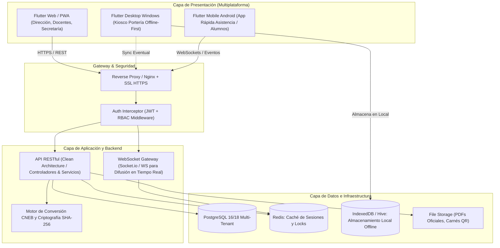
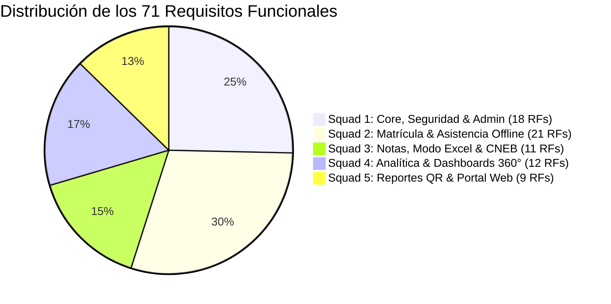
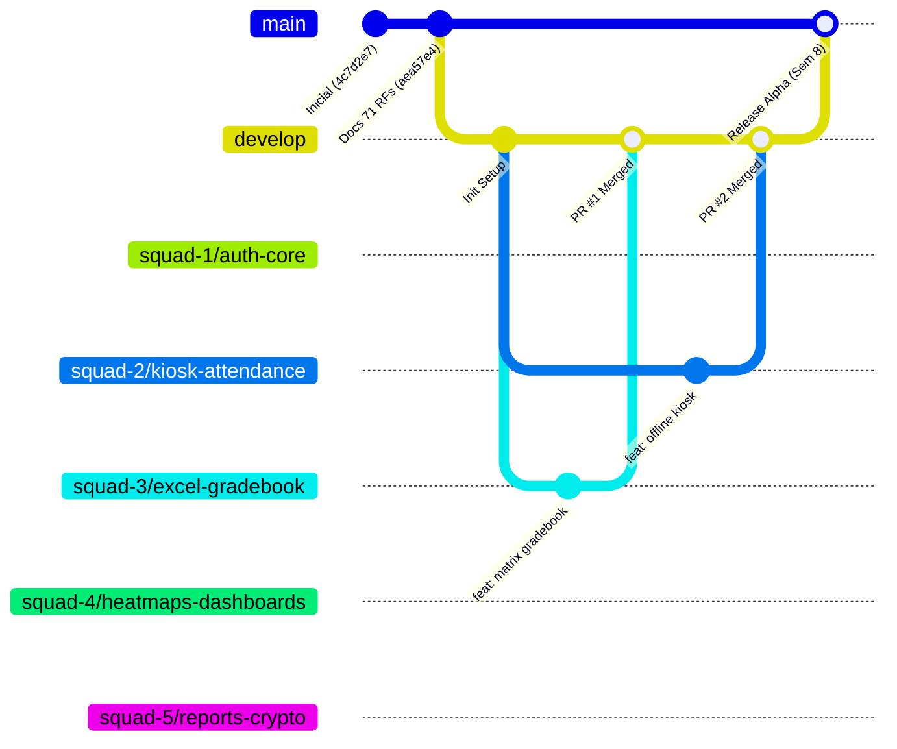

# DOCUMENTO DE ARQUITECTURA DE SOFTWARE Y DISTRIBUCIÓN DE TRABAJO TÉCNICO

**Proyecto:** Sistema de Información Integral de Gestión Administrativa y Plataforma de Difusión Digital  
**Institución Receptora:** Planteles de Aplicación "Guamán Poma de Ayala" - UNSCH  
**Equipo Ejecutor:** EPIS - UNSCH (Servicio Social Universitario IS-480, Semestre 2026-II)  
**Versión del Documento:** 1.0  
**Fecha:** 21 de Septiembre de 2026  

---

## 1. VISIÓN GENERAL Y PRINCIPIOS DE ARQUITECTURA

El sistema está concebido bajo una arquitectura desacoplada, escalable, modular y orientada al dominio (**Domain-Driven Design / Clean Architecture**), garantizando alta disponibilidad, mantenibilidad y resiliencia ante contingencias de conectividad en los planteles escolares.



### Principios Fundamentales del Diseño
1. **Clean Architecture en Frontend y Backend:** Separación tajante entre entidades de dominio, casos de uso, repositorios y capas de presentación.
2. **Aislamiento Multi-Tenant:** Persistencia en PostgreSQL asegurada por clave discriminadora `tenant_id` en todas las consultas y tablas compartidas.
3. **Estrategia Offline-First:** Para el Kiosco de Asistencia (`RF-25`), las transacciones se almacenan localmente en búfer (`IndexedDB`/`Hive`) y se sincronizan atómicamente al restablecer conexión.
4. **Reactividad en Tiempo Real:** Canales WebSockets bidireccionales para propagación de asistencia de aula (`RF-27`) y auto-guardado en segundo plano con cálculo en cascada (`RF-45`).
5. **Inmutabilidad y Sello Criptográfico:** Generación de digests SHA-256 inmutables para documentos oficiales verificables públicamente mediante códigos QR (`RF-60`).

---

## 2. REPARTO ESTRATÉGICO DE FUNCIONALIDADES POR EQUIPOS (SQUADS)

Para la ejecución eficiente durante las **Semanas 4 a 8 (Fase II)**, los **71 Requisitos Funcionales** y los **13 Módulos** se dividen en **5 Squads Técnicos Especializados**. Cada integrante del equipo lidera un squad con responsabilidades directas en Frontend, Backend y Base de Datos.



---

### SQUAD 1: Core, Autenticación, Configuración Institucional y Auditoría
* **Líder Técnico:** Ovalle Luyo, Steve Smith (`@steveovalle27-lgtm`)
* **Módulos a Cargo:** 
  * **Módulo 1:** Acceso, Autenticación JWT y RBAC (`RF-01` a `RF-04`)
  * **Módulo 2:** Administración de Usuarios y Directorio (`RF-05` a `RF-09`)
  * **Módulo 3:** Configuración Escolar, Periodos y Escalas (`RF-10` a `RF-14`)
  * **Módulo 12:** Trazabilidad, Auditoría y Protección de Datos Ley 29733 (`RF-65` a `RF-68`)
* **Total de Requisitos:** **18 RFs**

| Capa | Entregables y Responsabilidades Técnicas |
|---|---|
| **Base de Datos** | Tablas maestras: `usuarios`, `roles`, `permisos`, `institucion_sedes`, `anios_lectivos`, `periodos_academicos`, `escalas_calificacion`, `logs_auditoria`. Migraciones base y triggers de inmutabilidad en PostgreSQL. |
| **Backend** | Microservicios/módulos de Autenticación (`AuthService`, JWT Access/Refresh tokens con rotación, bcrypt), Guardias de RBAC, CRUD administrativo de usuarios y sedes, Middleware de auditoría inmutable (captura IP, User-Agent, Tenant, Payload diferencial). |
| **Frontend** | Vistas de Login seguro, Recuperación de contraseña, Panel de administración de usuarios (roles, estados, asignación de sedes), Configuración del año académico, y Visor de auditoría para directores. |

---

### SQUAD 2: Gestión Académica, Matrícula y Asistencia Offline-First
* **Líder Técnico:** Leon Reyna, Cesar Antonio (`@cesarleon27-ai`)
* **Módulos a Cargo:**
  * **Módulo 4:** Gestión Académica, Matrícula y Carga Lectiva (`RF-15` a `RF-19`)
  * **Módulo 5:** Asistencia Estudiantil, Kiosco Offline-First, App Rápida y Carnés QR (`RF-20` a `RF-27`)
  * **Módulo 6:** Asistencia y Cómputo de Horas de Practicantes EPIS (`RF-28` a `RF-31`)
  * **Módulo 7:** Horas de Docentes Contratados y Reprogramación (`RF-32` a `RF-35`)
* **Total de Requisitos:** **21 RFs**

| Capa | Entregables y Responsabilidades Técnicas |
|---|---|
| **Base de Datos** | Tablas: `grados_secciones`, `cursos`, `matriculas`, `carga_docente`, `asistencias_alumnos`, `asistencias_practicantes`, `asistencias_docentes_contratados`, `carnes_qr_log`. |
| **Backend** | API REST de Matrícula y Asignación de carga lectiva; Gateway WebSockets para difusión en tiempo real de asistencia (< 500 ms); Endpoints de sincronización por lotes (`/sync-bulk-attendance`); Lógica de cómputo de horas para el convenio UNSCH. |
| **Frontend** | Pantallas de Matrícula y gestión de secciones; **Módulo Kiosco de Portería Offline-First** (modo pantalla completa, lector de código de barras/QR físico, persistencia en IndexedDB/Hive, cola de reintentos); App móvil/web de toma rápida de asistencia en 1 toque; Generador de carnés escolares QR en PDF masivo. |

---

### SQUAD 3: Evaluación Pedagógica, Planilla Rápida y Motor CNEB
* **Líder Técnico:** Paipay Vega, Eduardo Sebastian (`@Eduardo-Sebastian-Paipay-Vega`)
* **Módulos a Cargo:**
  * **Módulo 8:** Calificaciones en Tiempo Real, Modo Excel, Auto-Guardado y Conversión CNEB (`RF-36` a `RF-46`)
* **Total de Requisitos:** **11 RFs** *(Núcleo de Innovación y Alta Complejidad UX)*

| Capa | Entregables y Responsabilidades Técnicas |
|---|---|
| **Base de Datos** | Tablas: `evaluaciones`, `criterios_rubricas`, `calificaciones` (campos duales: `nota_vigesimal` NUMERIC(4,2), `nota_literal` VARCHAR(2)), `conclusiones_descriptivas`, `banco_conclusiones_cneb`, `cierres_periodo`. |
| **Backend** | Motor de conversión dual automática (algoritmo vigesimal 0-20 a literales AD, A, B, C oficial MINEDU); Endpoints de auto-guardado concurrente con bloqueo optimista (`debounce` 400 ms); Lógica de cierre formal de periodos con congelamiento de actas; Banco taxonómico de conclusiones descriptivas contextuales. |
| **Frontend** | **Planilla Rápida de Notas ("Modo Excel"):** Componente matricial avanzado en Flutter con soporte completo de navegación por teclado (flechas, Tab, Enter), validación en caliente, pegado masivo desde portapapeles (Ctrl+V); Asistente predictivo de conclusiones descriptivas; Indicador visual de auto-guardado en tiempo real ("Guardado en la nube"). |

---

### SQUAD 4: Inteligencia de Datos, Mapas de Calor y Dashboards 360°
* **Líder Técnico:** Montero Gutiérrez, Brandon Fernando (`@brandonmontero27-g`)
* **Módulos a Cargo:**
  * **Módulo 9:** Mapas de Calor con Navegación Drill-Down (`RF-47` a `RF-51`)
  * **Módulo 10:** Dashboards, Ficha 360° del Alumno y Métricas SSU IS-480 (`RF-52` a `RF-58`)
* **Total de Requisitos:** **12 RFs**

| Capa | Entregables y Responsabilidades Técnicas |
|---|---|
| **Base de Datos** | Vistas materializadas y consultas analíticas indexadas: `vm_rendimiento_seccion`, `vm_asistencia_mensual`, `vm_alertas_desercion`; Índices compuestos para agregaciones multidimensionales. |
| **Backend** | Servicios de analítica agregada; Algoritmo de detección temprana de deserción escolar (ponderación de inasistencias consecutivas y caídas de notas); Servicio de métricas de impacto SSU (horas de ejecución, porcentaje de adopción escolar, actas digitales generadas). |
| **Frontend** | **Componente Mapas de Calor:** Visualización cromática interactiva con navegación jerárquica Drill-Down (Colegio -> Nivel -> Grado -> Sección -> Alumno); **Ficha Integral 360° del Estudiante:** Dashboard unificado con kardex, asistencia y gráfico de radar de competencias; Panel de Acreditación SSU IS-480 para docentes tutores UNSCH. |

---

### SQUAD 5: Secretaría Digital, Criptografía Documental y Portal Web
* **Líder Técnico:** Rodríguez Quispe, Grissel Arascely (`@Arascely`)
* **Módulos a Cargo:**
  * **Módulo 11:** Emisión de Reportes y Verificación Criptográfica QR (`RF-59` a `RF-64`)
  * **Módulo 13:** Plataforma de Difusión Digital y Portal Institucional (`RF-69` a `RF-71`)
* **Total de Requisitos:** **9 RFs**

| Capa | Entregables y Responsabilidades Técnicas |
|---|---|
| **Base de Datos** | Tablas: `documentos_emitidos` (almacena `hash_sha256`, `qr_token`, `metadata_firmante`, `fecha_emision`), `comunicados_cartelera`, `eventos_calendario_civico`, `publicaciones_portal`. |
| **Backend** | Motor de generación de reportes y boletas PDF de alta fidelidad con encabezados institucionales; Servicio criptográfico generador de Hash SHA-256 inmutable y token de verificación; Endpoint público sin autenticación para validación de certificados y boletas (`/api/v1/public/verify-document/{token}`). |
| **Frontend** | Interfaz de secretaría para emisión masiva y descarga de boletas y cuadros de mérito; **Página Web Pública de Validación QR** (diseño ligero, responsivo para smartphones); Portal institucional público y cartelera digital de comunicados y calendario cívico escolar. |

---

## 3. MAPA MAESTRO DE ASIGNACIÓN (71 REQUISITOS FUNCIONALES)

| Rango de RFs | Módulo | Squad Asignado | Responsable Principal |
|:---:|---|:---:|---|
| `RF-01` a `RF-04` | M1: Acceso, Autenticación y RBAC | **Squad 1** | Steve Smith Ovalle Luyo |
| `RF-05` a `RF-09` | M2: Administración de Usuarios y Directorio | **Squad 1** | Steve Smith Ovalle Luyo |
| `RF-10` a `RF-14` | M3: Configuración Escolar y Periodos | **Squad 1** | Steve Smith Ovalle Luyo |
| `RF-15` a `RF-19` | M4: Gestión Académica y Matrícula | **Squad 2** | Cesar Antonio Leon Reyna |
| `RF-20` a `RF-27` | M5: Asistencia, Kiosco Offline y Carnés QR | **Squad 2** | Cesar Antonio Leon Reyna |
| `RF-28` a `RF-31` | M6: Asistencia de Practicantes EPIS | **Squad 2** | Cesar Antonio Leon Reyna |
| `RF-32` a `RF-35` | M7: Horas Docentes Contratados | **Squad 2** | Cesar Antonio Leon Reyna |
| `RF-36` a `RF-46` | M8: Notas en Tiempo Real, Modo Excel y CNEB | **Squad 3** | Eduardo Sebastian Paipay Vega |
| `RF-47` a `RF-51` | M9: Mapas de Calor con Drill-Down | **Squad 4** | Brandon Fernando Montero Gutiérrez |
| `RF-52` a `RF-58` | M10: Dashboards, Ficha 360° y Métricas SSU | **Squad 4** | Brandon Fernando Montero Gutiérrez |
| `RF-59` a `RF-64` | M11: Reportes Oficiales y Criptografía QR | **Squad 5** | Grissel Arascely Rodríguez Quispe |
| `RF-65` a `RF-68` | M12: Auditoría Inmutable y Ley 29733 | **Squad 1** | Steve Smith Ovalle Luyo |
| `RF-69` a `RF-71` | M13: Difusión Digital y Portal Web | **Squad 5** | Grissel Arascely Rodríguez Quispe |

---

## 4. ESTRUCTURA DE CARPETAS Y ARQUITECTURA DE CÓDIGO

Para evitar colisiones en Git y garantizar independencia de trabajo entre squads, se implementa una arquitectura modular limpia tanto en el Frontend Flutter como en el Backend:

### Frontend (Flutter Clean Architecture)
```
lib/
├── core/                         # Núcleo transversal compartido
│   ├── network/                  # Clientes HTTP (Dio), interceptores JWT, WebSocket Client
│   ├── theme/                    # Material 3 Design System, tokens, paletas institucionales
│   ├── utils/                    # Criptografía SHA-256, formateadores de fecha, validadores
│   └── database/                 # Hive / IndexedDB para soporte Offline-First
├── features/                     # Módulos encapsulados por Squad
│   ├── auth/                     # [Squad 1] Login, Recuperación, Guards
│   ├── admin_config/             # [Squad 1] Usuarios, Sedes, Años Lectivos, Auditoría
│   ├── academic_management/      # [Squad 2] Matrícula, Carga Lectiva, Secciones
│   ├── attendance_kiosk/         # [Squad 2] Kiosco Portería, Scanner QR, Offline Sync
│   ├── attendance_staff/         # [Squad 2] Practicantes EPIS y Docentes Contratados
│   ├── gradebook_excel/          # [Squad 3] Planilla Matricial, Auto-guardado, Conclusiones
│   ├── analytics_heatmaps/       # [Squad 4] Mapas de calor interactivos, Drill-Down
│   ├── dashboards_360/           # [Squad 4] Ficha 360°, Deserción, Métricas SSU
│   ├── reports_verification/     # [Squad 5] Emisión Boletas, Visor de Verificación QR
│   └── public_portal/            # [Squad 5] Portal web, Cartelera institucional
└── main.dart                     # Punto de entrada de la aplicación
```

### Backend (Clean Architecture / Modularity)
```
src/
├── core/                         # Infraestructura común
│   ├── database/                 # Pool de conexiones PostgreSQL, transacciones
│   ├── security/                 # JWT, RBAC Guards, Encriptación bcrypt
│   ├── websocket/                # Gateway central de eventos en tiempo real
│   └── middlewares/              # Logger de auditoría inmutable, Error Handler
└── modules/                      # Subdominios de negocio por Squad
    ├── auth/                     # [Squad 1] Controladores, Casos de Uso, Repositorios Auth
    ├── administration/           # [Squad 1] Sedes, Ciclos escolares, Roles, Logs
    ├── academics/                # [Squad 2] Matrícula, Grados, Asignación de Carga
    ├── attendance/               # [Squad 2] Asistencia Alumnos, Sync Offline Kiosco
    ├── staff_tracking/           # [Squad 2] Horas Practicantes UNSCH y Contratados
    ├── grades/                   # [Squad 3] Notas, Motor CNEB, Conclusiones, Cierre
    ├── analytics/                # [Squad 4] Vistas agregadas, Alertas de abandono
    ├── ssu_impact/               # [Squad 4] KPIs de Acreditación IS-480
    ├── document_crypto/          # [Squad 5] Motor PDF, Sello Hash SHA-256, QR Público
    └── portal/                   # [Squad 5] Comunicados y Calendario Cívico
```

---

## 5. FLUJO DE INTEGRACIÓN CONTINUA Y PROTOCOLO GIT

Cada squad trabaja de forma aislada mediante ramas de características (**Feature Branches**), integrando en la rama `develop` antes del paso a `main`:



### Convenciones de Ramas por Equipo:
* `feature/squad-1/auth-rbac`
* `feature/squad-2/kiosk-offline`
* `feature/squad-3/gradebook-excel`
* `feature/squad-4/heatmaps-drilldown`
* `feature/squad-5/pdf-crypto-qr`
