# Casos de Uso - Squad 1: Core, Seguridad, Configuración y Auditoría

**Responsable Técnico:** Brandon Fernando Montero Gutiérrez (`@brandonmontero27-g`)  
**Rama de Desarrollo:** `feature/squad-1/auth-core`  
**Total de Casos de Uso:** 18 Casos de Uso Formatos UML  
**Enfoque de Arquitectura:** Seguridad, Core y Auditoría: Autenticación JWT, control de roles (RBAC), configuración escolar, multi-tenant y trazabilidad inmutable (Ley 29733).  

En esta carpeta se encuentra la especificación formal individual (estándar UML / Cockburn) de cada uno de los casos de uso asignados a este equipo:

---

## Diagrama General de Casos de Uso del Squad

```mermaid
flowchart LR
    Actor[("Actor Principal")]
    Actor --> CU_SEG_01("CU-SEG-01: Iniciar Sesión en la Plataforma")
    Actor --> CU_SEG_02("CU-SEG-02: Cierre de Sesión Seguro y Terminación por Inactividad")
    Actor --> CU_SEG_03("CU-SEG-03: Restablecimiento Asistido de Contraseñas de Acceso")
    Actor --> CU_SEG_04("CU-SEG-04: Control de Privilegios y Acceso Basado en Roles (RBAC)")
    Actor --> CU_USR_01("CU-USR-01: Registro y Alta Formal de Personal Institucional")
    Actor --> CU_USR_02("CU-USR-02: Importación Masiva de Usuarios desde Archivos Excel / CSV")
    Actor --> CU_USR_03("CU-USR-03: Gestión de Sedes y Planteles Escolares Multi-Tenant")
    Actor --> CU_USR_04("CU-USR-04: Directorio Escolar y Búsqueda Rápida de Personal")
    Actor --> CU_USR_05("CU-USR-05: Gestión de Perfil Personal y Cambio Autónomo de Credenciales")
    Actor --> CU_INS_01("CU-INS-01: Parametrización del Año Lectivo y Calendario Escolar")
    Actor --> CU_INS_02("CU-INS-02: Apertura, Parametrización y Cierre de Periodos Académicos")
    Actor --> CU_INS_03("CU-INS-03: Estructuración de Niveles Educativos, Grados y Secciones")
    Actor --> CU_INS_04("CU-INS-04: Definición de Escalas de Calificación Institucionales (Dual CNEB)")
    Actor --> CU_INS_05("CU-INS-05: Parámetros Globales del Sistema y Membretes Institucionales")
    Actor --> CU_AUD_01("CU-AUD-01: Registro Inmutable de Auditoría de Eventos y Seguridad")
    Actor --> CU_AUD_02("CU-AUD-02: Trazabilidad Histórica de Modificaciones en Notas y Asistencias")
    Actor --> CU_AUD_03("CU-AUD-03: Módulo de Búsqueda y Monitoreo de Bitácoras de Auditoría")
    Actor --> CU_AUD_04("CU-AUD-04: Cumplimiento y Protección de Datos Personales (Ley N.° 29733)")
```

---

## Catálogo de Casos de Uso (.md Individuales)

| Caso de Uso | Requisito Asignado | Nombre del Caso de Uso | Nivel de Frecuencia |
|---|---|---|---|
| [CU-SEG-01](CU-SEG-01.md) | [RF-01](../../Requisitos%20Funcionales/Squad%201%20-%20Core%20y%20Seguridad/RF-01.md) | Iniciar Sesión en la Plataforma | Muy Alta (Múltiples veces por día) |
| [CU-SEG-02](CU-SEG-02.md) | [RF-02](../../Requisitos%20Funcionales/Squad%201%20-%20Core%20y%20Seguridad/RF-02.md) | Cierre de Sesión Seguro y Terminación por Inactividad | Alta (Al finalizar la jornada o cambio de turno) |
| [CU-SEG-03](CU-SEG-03.md) | [RF-03](../../Requisitos%20Funcionales/Squad%201%20-%20Core%20y%20Seguridad/RF-03.md) | Restablecimiento Asistido de Contraseñas de Acceso | Media |
| [CU-SEG-04](CU-SEG-04.md) | [RF-04](../../Requisitos%20Funcionales/Squad%201%20-%20Core%20y%20Seguridad/RF-04.md) | Control de Privilegios y Acceso Basado en Roles (RBAC) | Baja (Configuración inicial o reasignaciones) |
| [CU-USR-01](CU-USR-01.md) | [RF-05](../../Requisitos%20Funcionales/Squad%201%20-%20Core%20y%20Seguridad/RF-05.md) | Registro y Alta Formal de Personal Institucional | Media |
| [CU-USR-02](CU-USR-02.md) | [RF-06](../../Requisitos%20Funcionales/Squad%201%20-%20Core%20y%20Seguridad/RF-06.md) | Importación Masiva de Usuarios desde Archivos Excel / CSV | Baja (Inicio de año o semestre) |
| [CU-USR-03](CU-USR-03.md) | [RF-07](../../Requisitos%20Funcionales/Squad%201%20-%20Core%20y%20Seguridad/RF-07.md) | Gestión de Sedes y Planteles Escolares Multi-Tenant | Muy Baja (Configuración inicial) |
| [CU-USR-04](CU-USR-04.md) | [RF-08](../../Requisitos%20Funcionales/Squad%201%20-%20Core%20y%20Seguridad/RF-08.md) | Directorio Escolar y Búsqueda Rápida de Personal | Alta |
| [CU-USR-05](CU-USR-05.md) | [RF-09](../../Requisitos%20Funcionales/Squad%201%20-%20Core%20y%20Seguridad/RF-09.md) | Gestión de Perfil Personal y Cambio Autónomo de Credenciales | Baja |
| [CU-INS-01](CU-INS-01.md) | [RF-10](../../Requisitos%20Funcionales/Squad%201%20-%20Core%20y%20Seguridad/RF-10.md) | Parametrización del Año Lectivo y Calendario Escolar | Baja (Anual) |
| [CU-INS-02](CU-INS-02.md) | [RF-11](../../Requisitos%20Funcionales/Squad%201%20-%20Core%20y%20Seguridad/RF-11.md) | Apertura, Parametrización y Cierre de Periodos Académicos | Media (4 veces al año en régimen bimestral) |
| [CU-INS-03](CU-INS-03.md) | [RF-12](../../Requisitos%20Funcionales/Squad%201%20-%20Core%20y%20Seguridad/RF-12.md) | Estructuración de Niveles Educativos, Grados y Secciones | Baja |
| [CU-INS-04](CU-INS-04.md) | [RF-13](../../Requisitos%20Funcionales/Squad%201%20-%20Core%20y%20Seguridad/RF-13.md) | Definición de Escalas de Calificación Institucionales (Dual CNEB) | Muy Baja |
| [CU-INS-05](CU-INS-05.md) | [RF-14](../../Requisitos%20Funcionales/Squad%201%20-%20Core%20y%20Seguridad/RF-14.md) | Parámetros Globales del Sistema y Membretes Institucionales | Baja |
| [CU-AUD-01](CU-AUD-01.md) | [RF-65](../../Requisitos%20Funcionales/Squad%201%20-%20Core%20y%20Seguridad/RF-65.md) | Registro Inmutable de Auditoría de Eventos y Seguridad | Constante (En cada petición sensible) |
| [CU-AUD-02](CU-AUD-02.md) | [RF-66](../../Requisitos%20Funcionales/Squad%201%20-%20Core%20y%20Seguridad/RF-66.md) | Trazabilidad Histórica de Modificaciones en Notas y Asistencias | Muy Alta (En cada guardado de notas o cambios de asistencia) |
| [CU-AUD-03](CU-AUD-03.md) | [RF-67](../../Requisitos%20Funcionales/Squad%201%20-%20Core%20y%20Seguridad/RF-67.md) | Módulo de Búsqueda y Monitoreo de Bitácoras de Auditoría | Media |
| [CU-AUD-04](CU-AUD-04.md) | [RF-68](../../Requisitos%20Funcionales/Squad%201%20-%20Core%20y%20Seguridad/RF-68.md) | Cumplimiento y Protección de Datos Personales (Ley N.° 29733) | Baja |

---

## Vínculos y Trazabilidad con Fase 2

* 📋 **Requisitos Funcionales:** [Directorio de RFs del Squad](../../Requisitos%20Funcionales/Squad%201%20-%20Core%20y%20Seguridad/README.md)
* 🏗️ **Arquitectura y Contratos API:** [contratos_api.md](../../Arquitectura/Squad%201%20-%20Core%20y%20Seguridad/contratos_api.md)
* 🗄️ **Modelado de Datos Relacional:** [esquema_datos.sql](../../Arquitectura/Squad%201%20-%20Core%20y%20Seguridad/esquema_datos.sql)
