# Casos de Uso - Squad 2: Gestión Académica, Matrícula y Asistencia Offline-First

**Responsable Técnico:** Eduardo Sebastian Paipay Vega (`@Eduardo-Sebastian-Paipay-Vega`)  
**Rama de Desarrollo:** `feature/squad-2/academic-attendance`  
**Total de Casos de Uso:** 21 Casos de Uso Formatos UML  
**Enfoque de Arquitectura:** Académico y Asistencia Offline-First: Matrícula, Kiosco de portería con búfer local (IndexedDB/Hive), carnés QR, asistencia por WebSockets y control de horas practicantes/docentes.  

En esta carpeta se encuentra la especificación formal individual (estándar UML / Cockburn) de cada uno de los casos de uso asignados a este equipo:

---

## Diagrama General de Casos de Uso del Squad

```mermaid
flowchart LR
    Actor[("Actor Principal")]
    Actor --> CU_ACD_01("CU-ACD-01: Registro, Filiación y Actualización de Ficha de Estudiante")
    Actor --> CU_ACD_02("CU-ACD-02: Matrícula Escolar y Asignación de Estudiantes a Secciones")
    Actor --> CU_ACD_03("CU-ACD-03: Catálogo Curricular y Planes de Estudio oficiales según CNEB")
    Actor --> CU_ACD_04("CU-ACD-04: Asignación y Distribución de Carga Lectiva Docente")
    Actor --> CU_ACD_05("CU-ACD-05: Consulta y Generación de Nóminas Oficiales de Aula")
    Actor --> CU_AST_01("CU-AST-01: Registro Ordinario de Asistencia Escolar en el Aula")
    Actor --> CU_AST_02("CU-AST-02: Registro de Ingreso Físico en Modo Kiosco de Portería ('Wachiman')")
    Actor --> CU_AST_03("CU-AST-03: Gestión y Justificación Formal de Inasistencias y Tardanzas")
    Actor --> CU_AST_04("CU-AST-04: Consolidación y Consulta del Récord de Asistencia por Estudiante")
    Actor --> CU_AST_05("CU-AST-05: Detección y Generación de Alertas por Ausentismo Crónico")
    Actor --> CU_AST_06("CU-AST-06: Operar Kiosco de Portería en Modo Offline-First y Sincronización Diferida")
    Actor --> CU_AST_07("CU-AST-07: Generación y Emisión Masiva de Carnés Escolares con Código QR Criptográfico")
    Actor --> CU_AST_08("CU-AST-08: Toma Rápida en App Móvil y Difusión en Tiempo Real vía WebSockets")
    Actor --> CU_PRA_01("CU-PRA-01: Registro Diario de Jornada y Permanencia de Practicantes EPIS-UNSCH")
    Actor --> CU_PRA_02("CU-PRA-02: Asignación de Docente Guía y Asesor Institucional")
    Actor --> CU_PRA_03("CU-PRA-03: Cómputo Acumulado de Horas Efectivas de Prácticas Universitarias")
    Actor --> CU_PRA_04("CU-PRA-04: Emisión de Fichas Oficiales de Prácticas para la UNSCH")
    Actor --> CU_DOC_01("CU-DOC-01: Registro y Marcación de Horas Lectivas de Docentes Contratados")
    Actor --> CU_DOC_02("CU-DOC-02: Registro de Justificaciones y Reprogramación de Clases Docentes")
    Actor --> CU_DOC_03("CU-DOC-03: Consolidación Mensual de Cumplimiento de Horas Lectivas Dictadas")
    Actor --> CU_DOC_04("CU-DOC-04: Supervisión y Monitoreo de Cobertura y Puntualidad de Clases")
```

---

## Catálogo de Casos de Uso (.md Individuales)

| Caso de Uso | Requisito Asignado | Nombre del Caso de Uso | Nivel de Frecuencia |
|---|---|---|---|
| [CU-ACD-01](CU-ACD-01.md) | [RF-15](../../Requisitos%20Funcionales/Squad%202%20-%20Matricula%20y%20Asistencia/RF-15.md) | Registro, Filiación y Actualización de Ficha de Estudiante | Alta (En periodos de inscripción) |
| [CU-ACD-02](CU-ACD-02.md) | [RF-16](../../Requisitos%20Funcionales/Squad%202%20-%20Matricula%20y%20Asistencia/RF-16.md) | Matrícula Escolar y Asignación de Estudiantes a Secciones | Alta (Fase de matrícula) |
| [CU-ACD-03](CU-ACD-03.md) | [RF-17](../../Requisitos%20Funcionales/Squad%202%20-%20Matricula%20y%20Asistencia/RF-17.md) | Catálogo Curricular y Planes de Estudio oficiales según CNEB | Baja |
| [CU-ACD-04](CU-ACD-04.md) | [RF-18](../../Requisitos%20Funcionales/Squad%202%20-%20Matricula%20y%20Asistencia/RF-18.md) | Asignación y Distribución de Carga Lectiva Docente | Media |
| [CU-ACD-05](CU-ACD-05.md) | [RF-19](../../Requisitos%20Funcionales/Squad%202%20-%20Matricula%20y%20Asistencia/RF-19.md) | Consulta y Generación de Nóminas Oficiales de Aula | Alta |
| [CU-AST-01](CU-AST-01.md) | [RF-20](../../Requisitos%20Funcionales/Squad%202%20-%20Matricula%20y%20Asistencia/RF-20.md) | Registro Ordinario de Asistencia Escolar en el Aula | Diaria (Al inicio de cada jornada) |
| [CU-AST-02](CU-AST-02.md) | [RF-21](../../Requisitos%20Funcionales/Squad%202%20-%20Matricula%20y%20Asistencia/RF-21.md) | Registro de Ingreso Físico en Modo Kiosco de Portería ('Wachiman') | Muy Alta (Pico de 7:15 AM a 8:00 AM) |
| [CU-AST-03](CU-AST-03.md) | [RF-22](../../Requisitos%20Funcionales/Squad%202%20-%20Matricula%20y%20Asistencia/RF-22.md) | Gestión y Justificación Formal de Inasistencias y Tardanzas | Media |
| [CU-AST-04](CU-AST-04.md) | [RF-23](../../Requisitos%20Funcionales/Squad%202%20-%20Matricula%20y%20Asistencia/RF-23.md) | Consolidación y Consulta del Récord de Asistencia por Estudiante | Alta |
| [CU-AST-05](CU-AST-05.md) | [RF-24](../../Requisitos%20Funcionales/Squad%202%20-%20Matricula%20y%20Asistencia/RF-24.md) | Detección y Generación de Alertas por Ausentismo Crónico | Diaria (Al finalizar la toma de asistencia) |
| [CU-AST-06](CU-AST-06.md) | [RF-25](../../Requisitos%20Funcionales/Squad%202%20-%20Matricula%20y%20Asistencia/RF-25.md) | Operar Kiosco de Portería en Modo Offline-First y Sincronización Diferida | Alta (En contingencias de corte de internet en portería) |
| [CU-AST-07](CU-AST-07.md) | [RF-26](../../Requisitos%20Funcionales/Squad%202%20-%20Matricula%20y%20Asistencia/RF-26.md) | Generación y Emisión Masiva de Carnés Escolares con Código QR Criptográfico | Baja (Inicio de año escolar) |
| [CU-AST-08](CU-AST-08.md) | [RF-27](../../Requisitos%20Funcionales/Squad%202%20-%20Matricula%20y%20Asistencia/RF-27.md) | Toma Rápida en App Móvil y Difusión en Tiempo Real vía WebSockets | Diaria (Primera hora de clases) |
| [CU-PRA-01](CU-PRA-01.md) | [RF-28](../../Requisitos%20Funcionales/Squad%202%20-%20Matricula%20y%20Asistencia/RF-28.md) | Registro Diario de Jornada y Permanencia de Practicantes EPIS-UNSCH | Diaria (Entrada y Salida de turno) |
| [CU-PRA-02](CU-PRA-02.md) | [RF-29](../../Requisitos%20Funcionales/Squad%202%20-%20Matricula%20y%20Asistencia/RF-29.md) | Asignación de Docente Guía y Asesor Institucional | Baja (Inicio de ciclo universitario) |
| [CU-PRA-03](CU-PRA-03.md) | [RF-30](../../Requisitos%20Funcionales/Squad%202%20-%20Matricula%20y%20Asistencia/RF-30.md) | Cómputo Acumulado de Horas Efectivas de Prácticas Universitarias | Alta |
| [CU-PRA-04](CU-PRA-04.md) | [RF-31](../../Requisitos%20Funcionales/Squad%202%20-%20Matricula%20y%20Asistencia/RF-31.md) | Emisión de Fichas Oficiales de Prácticas para la UNSCH | Baja (Cierre de ciclo universitario) |
| [CU-DOC-01](CU-DOC-01.md) | [RF-32](../../Requisitos%20Funcionales/Squad%202%20-%20Matricula%20y%20Asistencia/RF-32.md) | Registro y Marcación de Horas Lectivas de Docentes Contratados | Diaria (Por cada bloque pedagógico) |
| [CU-DOC-02](CU-DOC-02.md) | [RF-33](../../Requisitos%20Funcionales/Squad%202%20-%20Matricula%20y%20Asistencia/RF-33.md) | Registro de Justificaciones y Reprogramación de Clases Docentes | Media |
| [CU-DOC-03](CU-DOC-03.md) | [RF-34](../../Requisitos%20Funcionales/Squad%202%20-%20Matricula%20y%20Asistencia/RF-34.md) | Consolidación Mensual de Cumplimiento de Horas Lectivas Dictadas | Mensual (Al cierre de cada mes) |
| [CU-DOC-04](CU-DOC-04.md) | [RF-35](../../Requisitos%20Funcionales/Squad%202%20-%20Matricula%20y%20Asistencia/RF-35.md) | Supervisión y Monitoreo de Cobertura y Puntualidad de Clases | Diaria / Continua |

---

## Vínculos y Trazabilidad con Fase 2

* 📋 **Requisitos Funcionales:** [Directorio de RFs del Squad](../../Requisitos%20Funcionales/Squad%202%20-%20Matricula%20y%20Asistencia/README.md)
* 🏗️ **Arquitectura y Contratos API:** [contratos_api.md](../../Arquitectura/Squad%202%20-%20Matricula%20y%20Asistencia/contratos_api.md)
* 🗄️ **Modelado de Datos Relacional:** [esquema_datos.sql](../../Arquitectura/Squad%202%20-%20Matricula%20y%20Asistencia/esquema_datos.sql)
