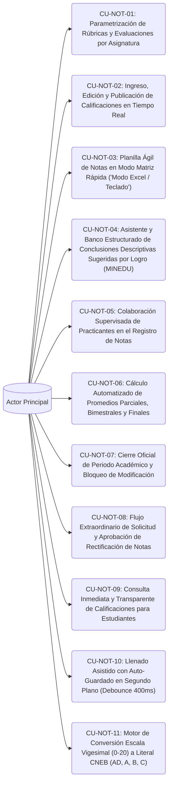

# Casos de Uso - Squad 3: Evaluación Pedagógica, Planilla Rápida y Motor CNEB

**Responsable Técnico:** Steve Smith Ovalle Luyo (`@steveovalle27-lgtm`)  
**Rama de Desarrollo:** `feature/squad-3/grades-engine`  
**Total de Casos de Uso:** 11 Casos de Uso Formatos UML  
**Enfoque de Arquitectura:** Calificaciones y Motor CNEB: Planilla matricial ultra-rápida ('Modo Excel'), auto-guardado en segundo plano con debounce de 400 ms, conclusiones descriptivas MINEDU, escala dual (0-20 a AD/A/B/C) y cierre de periodos.  

En esta carpeta se encuentra la especificación formal individual (estándar UML / Cockburn) de cada uno de los casos de uso asignados a este equipo:

---

## Diagrama General de Casos de Uso del Squad

---

## Catálogo de Casos de Uso (.md Individuales)

| Caso de Uso | Requisito Asignado | Nombre del Caso de Uso | Nivel de Frecuencia |
|---|---|---|---|
| [CU-NOT-01](CU-NOT-01.md) | [RF-36](../../Requisitos%20Funcionales/Squad%203%20-%20Calificaciones%20y%20Modo%20Excel/RF-36.md) | Parametrización de Rúbricas y Evaluaciones por Asignatura | Media (Al inicio de cada periodo) |
| [CU-NOT-02](CU-NOT-02.md) | [RF-37](../../Requisitos%20Funcionales/Squad%203%20-%20Calificaciones%20y%20Modo%20Excel/RF-37.md) | Ingreso, Edición y Publicación de Calificaciones en Tiempo Real | Muy Alta |
| [CU-NOT-03](CU-NOT-03.md) | [RF-38](../../Requisitos%20Funcionales/Squad%203%20-%20Calificaciones%20y%20Modo%20Excel/RF-38.md) | Planilla Ágil de Notas en Modo Matriz Rápida ('Modo Excel / Teclado') | Muy Alta (Cierre de evaluaciones) |
| [CU-NOT-04](CU-NOT-04.md) | [RF-39](../../Requisitos%20Funcionales/Squad%203%20-%20Calificaciones%20y%20Modo%20Excel/RF-39.md) | Asistente y Banco Estructurado de Conclusiones Descriptivas Sugeridas por Logro (MINEDU) | Alta (En cada cierre de bimestre) |
| [CU-NOT-05](CU-NOT-05.md) | [RF-40](../../Requisitos%20Funcionales/Squad%203%20-%20Calificaciones%20y%20Modo%20Excel/RF-40.md) | Colaboración Supervisada de Practicantes en el Registro de Notas | Media |
| [CU-NOT-06](CU-NOT-06.md) | [RF-41](../../Requisitos%20Funcionales/Squad%203%20-%20Calificaciones%20y%20Modo%20Excel/RF-41.md) | Cálculo Automatizado de Promedios Parciales, Bimestrales y Finales | Automática e Instantánea ante cualquier cambio |
| [CU-NOT-07](CU-NOT-07.md) | [RF-42](../../Requisitos%20Funcionales/Squad%203%20-%20Calificaciones%20y%20Modo%20Excel/RF-42.md) | Cierre Oficial de Periodo Académico y Bloqueo de Modificación | Media (4 veces al año) |
| [CU-NOT-08](CU-NOT-08.md) | [RF-43](../../Requisitos%20Funcionales/Squad%203%20-%20Calificaciones%20y%20Modo%20Excel/RF-43.md) | Flujo Extraordinario de Solicitud y Aprobación de Rectificación de Notas | Baja (Casos excepcionales) |
| [CU-NOT-09](CU-NOT-09.md) | [RF-44](../../Requisitos%20Funcionales/Squad%203%20-%20Calificaciones%20y%20Modo%20Excel/RF-44.md) | Consulta Inmediata y Transparente de Calificaciones para Estudiantes | Alta |
| [CU-NOT-10](CU-NOT-10.md) | [RF-45](../../Requisitos%20Funcionales/Squad%203%20-%20Calificaciones%20y%20Modo%20Excel/RF-45.md) | Llenado Asistido con Auto-Guardado en Segundo Plano (Debounce 400ms) | Constante durante la edición de notas |
| [CU-NOT-11](CU-NOT-11.md) | [RF-46](../../Requisitos%20Funcionales/Squad%203%20-%20Calificaciones%20y%20Modo%20Excel/RF-46.md) | Motor de Conversión Escala Vigesimal (0-20) a Literal CNEB (AD, A, B, C) | Muy Alta |

---

## Vínculos y Trazabilidad con Fase 2

* 📋 **Requisitos Funcionales:** [Directorio de RFs del Squad](../../Requisitos%20Funcionales/Squad%203%20-%20Calificaciones%20y%20Modo%20Excel/README.md)
* 🏗️ **Arquitectura y Contratos API:** [contratos_api.md](../../Arquitectura/Squad%203%20-%20Calificaciones%20y%20Modo%20Excel/contratos_api.md)
* 🗄️ **Modelado de Datos Relacional:** [esquema_datos.sql](../../Arquitectura/Squad%203%20-%20Calificaciones%20y%20Modo%20Excel/esquema_datos.sql)
