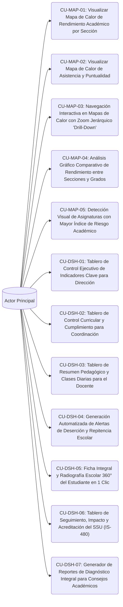

# Casos de Uso - Squad 4: Inteligencia de Datos, Mapas de Calor y Dashboards 360°

**Responsable Técnico:** Grissel Arascely Rodríguez Quispe (`@Arascely`)  
**Rama de Desarrollo:** `feature/squad-4/analytics-dashboards`  
**Total de Casos de Uso:** 12 Casos de Uso Formatos UML  
**Enfoque de Arquitectura:** Analítica, Inteligencia y Métricas: Mapas de calor con navegación interactiva Drill-Down, detección temprana de deserción/repitencia, radiografía escolar Ficha 360° y tablero de impacto SSU IS-480.  

En esta carpeta se encuentra la especificación formal individual (estándar UML / Cockburn) de cada uno de los casos de uso asignados a este equipo:

---

## Diagrama General de Casos de Uso del Squad

---

## Catálogo de Casos de Uso (.md Individuales)

| Caso de Uso | Requisito Asignado | Nombre del Caso de Uso | Nivel de Frecuencia |
|---|---|---|---|
| [CU-MAP-01](CU-MAP-01.md) | [RF-47](../../Requisitos%20Funcionales/Squad%204%20-%20Analitica%20y%20Dashboards/RF-47.md) | Visualizar Mapa de Calor de Rendimiento Académico por Sección | Media (Cierre de bimestre y reuniones pedagógicas) |
| [CU-MAP-02](CU-MAP-02.md) | [RF-48](../../Requisitos%20Funcionales/Squad%204%20-%20Analitica%20y%20Dashboards/RF-48.md) | Visualizar Mapa de Calor de Asistencia y Puntualidad | Semanal / Mensual |
| [CU-MAP-03](CU-MAP-03.md) | [RF-49](../../Requisitos%20Funcionales/Squad%204%20-%20Analitica%20y%20Dashboards/RF-49.md) | Navegación Interactiva en Mapas de Calor con Zoom Jerárquico 'Drill-Down' | Alta durante análisis institucional |
| [CU-MAP-04](CU-MAP-04.md) | [RF-50](../../Requisitos%20Funcionales/Squad%204%20-%20Analitica%20y%20Dashboards/RF-50.md) | Análisis Gráfico Comparativo de Rendimiento entre Secciones y Grados | Media |
| [CU-MAP-05](CU-MAP-05.md) | [RF-51](../../Requisitos%20Funcionales/Squad%204%20-%20Analitica%20y%20Dashboards/RF-51.md) | Detección Visual de Asignaturas con Mayor Índice de Riesgo Académico | Media |
| [CU-DSH-01](CU-DSH-01.md) | [RF-52](../../Requisitos%20Funcionales/Squad%204%20-%20Analitica%20y%20Dashboards/RF-52.md) | Tablero de Control Ejecutivo de Indicadores Clave para Dirección | Diaria |
| [CU-DSH-02](CU-DSH-02.md) | [RF-53](../../Requisitos%20Funcionales/Squad%204%20-%20Analitica%20y%20Dashboards/RF-53.md) | Tablero de Control Curricular y Cumplimiento para Coordinación | Diaria / Semanal |
| [CU-DSH-03](CU-DSH-03.md) | [RF-54](../../Requisitos%20Funcionales/Squad%204%20-%20Analitica%20y%20Dashboards/RF-54.md) | Tablero de Resumen Pedagógico y Clases Diarias para el Docente | Diaria (Al iniciar sesión) |
| [CU-DSH-04](CU-DSH-04.md) | [RF-55](../../Requisitos%20Funcionales/Squad%204%20-%20Analitica%20y%20Dashboards/RF-55.md) | Generación Automatizada de Alertas de Deserción y Repitencia Escolar | Semanal / Al cierre de evaluaciones |
| [CU-DSH-05](CU-DSH-05.md) | [RF-56](../../Requisitos%20Funcionales/Squad%204%20-%20Analitica%20y%20Dashboards/RF-56.md) | Ficha Integral y Radiografía Escolar 360° del Estudiante en 1 Clic | Alta durante atención a padres o consejos de grado |
| [CU-DSH-06](CU-DSH-06.md) | [RF-57](../../Requisitos%20Funcionales/Squad%204%20-%20Analitica%20y%20Dashboards/RF-57.md) | Tablero de Seguimiento, Impacto y Acreditación del SSU (IS-480) | Semanal / Al cierre de ciclo |
| [CU-DSH-07](CU-DSH-07.md) | [RF-58](../../Requisitos%20Funcionales/Squad%204%20-%20Analitica%20y%20Dashboards/RF-58.md) | Generador de Reportes de Diagnóstico Integral para Consejos Académicos | Bimestral |

---

## Vínculos y Trazabilidad con Fase 2

* 📋 **Requisitos Funcionales:** [Directorio de RFs del Squad](../../Requisitos%20Funcionales/Squad%204%20-%20Analitica%20y%20Dashboards/README.md)
* 🏗️ **Arquitectura y Contratos API:** [contratos_api.md](../../Arquitectura/Squad%204%20-%20Analitica%20y%20Dashboards/contratos_api.md)
* 🗄️ **Modelado de Datos Relacional:** [esquema_datos.sql](../../Arquitectura/Squad%204%20-%20Analitica%20y%20Dashboards/esquema_datos.sql)
