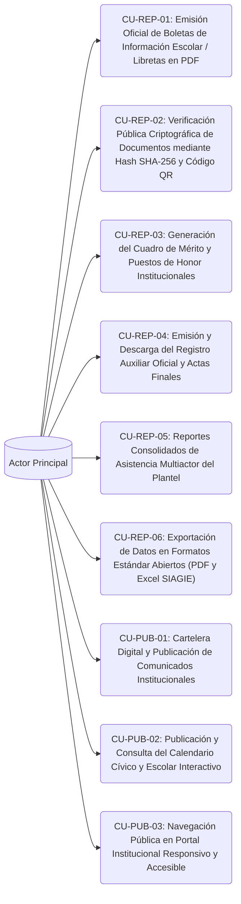

# Casos de Uso - Squad 5: Secretaría Digital, Criptografía Documental y Portal Web

**Responsable Técnico:** Cesar Antonio Leon Reyna (`@cesarleon27-ai`)  
**Rama de Desarrollo:** `feature/squad-5/secretary-portal`  
**Total de Casos de Uso:** 9 Casos de Uso Formatos UML  
**Enfoque de Arquitectura:** Secretaría y Portal Web: Emisión de boletas/libretas en PDF, actas y registros auxiliares, verificación documental pública con hash SHA-256 + QR, cartelera digital y portal web institucional.  

En esta carpeta se encuentra la especificación formal individual (estándar UML / Cockburn) de cada uno de los casos de uso asignados a este equipo:

---

## Diagrama General de Casos de Uso del Squad

---

## Catálogo de Casos de Uso (.md Individuales)

| Caso de Uso | Requisito Asignado | Nombre del Caso de Uso | Nivel de Frecuencia |
|---|---|---|---|
| [CU-REP-01](CU-REP-01.md) | [RF-59](../../Requisitos%20Funcionales/Squad%205%20-%20Secretaria%20y%20Portal%20Web/RF-59.md) | Emisión Oficial de Boletas de Información Escolar / Libretas en PDF | Bimestral / Anual |
| [CU-REP-02](CU-REP-02.md) | [RF-60](../../Requisitos%20Funcionales/Squad%205%20-%20Secretaria%20y%20Portal%20Web/RF-60.md) | Verificación Pública Criptográfica de Documentos mediante Hash SHA-256 y Código QR | Alta |
| [CU-REP-03](CU-REP-03.md) | [RF-61](../../Requisitos%20Funcionales/Squad%205%20-%20Secretaria%20y%20Portal%20Web/RF-61.md) | Generación del Cuadro de Mérito y Puestos de Honor Institucionales | Bimestral y Anual (Clausura escolar) |
| [CU-REP-04](CU-REP-04.md) | [RF-62](../../Requisitos%20Funcionales/Squad%205%20-%20Secretaria%20y%20Portal%20Web/RF-62.md) | Emisión y Descarga del Registro Auxiliar Oficial y Actas Finales | Bimestral / Fin de Año |
| [CU-REP-05](CU-REP-05.md) | [RF-63](../../Requisitos%20Funcionales/Squad%205%20-%20Secretaria%20y%20Portal%20Web/RF-63.md) | Reportes Consolidados de Asistencia Multiactor del Plantel | Mensual |
| [CU-REP-06](CU-REP-06.md) | [RF-64](../../Requisitos%20Funcionales/Squad%205%20-%20Secretaria%20y%20Portal%20Web/RF-64.md) | Exportación de Datos en Formatos Estándar Abiertos (PDF y Excel SIAGIE) | Media |
| [CU-PUB-01](CU-PUB-01.md) | [RF-69](../../Requisitos%20Funcionales/Squad%205%20-%20Secretaria%20y%20Portal%20Web/RF-69.md) | Cartelera Digital y Publicación de Comunicados Institucionales | Alta |
| [CU-PUB-02](CU-PUB-02.md) | [RF-70](../../Requisitos%20Funcionales/Squad%205%20-%20Secretaria%20y%20Portal%20Web/RF-70.md) | Publicación y Consulta del Calendario Cívico y Escolar Interactivo | Alta |
| [CU-PUB-03](CU-PUB-03.md) | [RF-71](../../Requisitos%20Funcionales/Squad%205%20-%20Secretaria%20y%20Portal%20Web/RF-71.md) | Navegación Pública en Portal Institucional Responsivo y Accesible | Muy Alta |

---

## Vínculos y Trazabilidad con Fase 2

* 📋 **Requisitos Funcionales:** [Directorio de RFs del Squad](../../Requisitos%20Funcionales/Squad%205%20-%20Secretaria%20y%20Portal%20Web/README.md)
* 🏗️ **Arquitectura y Contratos API:** [contratos_api.md](../../Arquitectura/Squad%205%20-%20Secretaria%20y%20Portal%20Web/contratos_api.md)
* 🗄️ **Modelado de Datos Relacional:** [esquema_datos.sql](../../Arquitectura/Squad%205%20-%20Secretaria%20y%20Portal%20Web/esquema_datos.sql)
