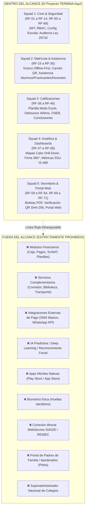

# DOCUMENTO OFICIAL DE DELIMITACIÓN Y FRONTERAS DEL PROYECTO
## ¿Dónde acaba el proyecto para no hacer más cosas? (Scope Freeze & Out-of-Scope)

### SISTEMA DE GESTIÓN ESCOLAR — PLANTELES DE APLICACIÓN "GUAMÁN POMA DE AYALA" (UNSCH)
**Servicio Social Universitario IS-480 (Periodo 2026-II)**  
**Escuela Profesional de Ingeniería de Sistemas — EPIS UNSCH**

---

## 1. PROPÓSITO DEL DOCUMENTO

El presente documento define formalmente la **línea de demarcación final** del proyecto. Su objetivo es blindar el desarrollo contra la corrupción de alcance (*scope creep*), evitar la sobrecarga de trabajo en los desarrolladores de los 5 squads y establecer con precisión matemática y funcional **dónde concluye el proyecto y qué queda estrictamente fuera de él**.

> [!CAUTION]
> **DECLARACIÓN DE ALCANCE CERRADO:**  
> Ningún squad ni desarrollador tiene autorización para implementar requerimientos, módulos, botones o servicios que no formen parte de la lista cerrada de los **71 Requisitos Funcionales (`RF-01` al `RF-71`)** y los **20 Requisitos No Funcionales (RNF)**.

---

## 2. FRONTERA DE ACABADO: ¿DÓNDE TERMINA EL SISTEMA?

El sistema finaliza exactamente en el límite de los **13 módulos y 71 Requisitos Funcionales**, distribuidos en los 5 squads técnicos:

---

## 3. MATRIZ EXHAUSTIVA: DENTRO VS. FUERA DEL ALCANCE

| Dimensión / Categoría | DENTRO DEL ALCANCE (Se implementa) | FUERA DEL ALCANCE (TERMINANTEMENTE PROHIBIDO) |
|---|---|---|
| **Finanzas y Dinero** | • Ninguna función económica. | ❌ **PROHIBIDO:** Pasarelas de pago (Visa, Yape, Plin), pago de pensiones, caja chica, facturación electrónica SUNAT, emisión de boletas de venta, contabilidad o cálculo de planillas de sueldos. |
| **Bienestar y Servicios Escolares** | • Ninguna función de servicios complementarios. | ❌ **PROHIBIDO:** Módulo de biblioteca (préstamo de libros, catálogo ISBN), módulo de comedor/cafetería escolar, control de transporte escolar o módulo de tópico médico/enfermería. |
| **Canales de Comunicación Externa** | • Panel web y difusión en pantalla en tiempo real (WebSockets / SSE). | ❌ **PROHIBIDO:** Envíos de SMS masivos con operadoras telefónicas, integración con la API de pago de WhatsApp Business, llamadas telefónicas automáticas o bots de Telegram. |
| **Inteligencia Artificial y Modelos** | • Asistente de conclusiones descriptivas basado en reglas, verbos pedagógicos y plantillas oficiales CNEB. • Mapas de calor descriptivos (notas y asistencia). | ❌ **PROHIBIDO:** Redes neuronales, algoritmos de Machine Learning predictivo de deserción escolar, bots generativos con LLMs comerciales de pago o visión artificial. |
| **Plataformas de Despliegue** | • Plataforma Web Responsive (Flutter Web) adaptada para computadoras, portátiles, tablets y pantallas móviles (PWA). | ❌ **PROHIBIDO:** Creación, compilación y publicación de apps móviles nativas en Kotlin/Java (Android) o Swift (iOS) en Google Play Store o Apple App Store. |
| **Identificación Física y Asistencia** | • Kiosco de portería Offline-First resiliente para PC con lector de código de barras/código QR. • Carnés escolares en PDF con código QR institucional. | ❌ **PROHIBIDO:** Sensores biométricos de huellas dactilares, cámaras biométricas de reconocimiento facial, torniquetes mecánicos o lectores RFID/NFC dedicados. |
| **Integraciones Gubernamentales** | • Generación de actas, nóminas y cuadros de mérito exportables en formatos oficiales Excel y PDF según normativa MINEDU. | ❌ **PROHIBIDO:** Conexión vía WebServices o APIs REST directas con los servidores centrales de MINEDU (SIAGIE) o bases de datos de RENIEC. |
| **Población de Usuarios (Piloto)** | • Administrador TI del Plantel. • Directivos y Coordinadores. • Docentes nombrados y contratados. • Practicantes de Educación. • Estudiantes (para consulta individual). | ❌ **PROHIBIDO:** Portal o credenciales de acceso para Padres de Familia / Apoderados durante la fase piloto; personal de limpieza o servicios no académicos; superadministrador multi-institucional. |
| **Seguridad y Verificación Documental** | • Verificación pública documental anti-falsificación mediante código QR con sello criptográfico SHA-256 e ID único. • Auditoría inmutable de eventos sensibles (Ley N.° 29733). | ❌ **PROHIBIDO:** Firma digital avanzada con certificados PKI de pago (tipo Adobe Sign o DocuSign) o tokens criptográficos USB físicos de RENIEC. |
| **Alcance Institucional y Multi-Tenant** | • Piloto validado exclusivamente en los Planteles de Aplicación "Guamán Poma de Ayala" (UNSCH), Ayacucho. • Soporte de campo `tenant_id` en base de datos para aislamiento lógico. | ❌ **PROHIBIDO:** Puesta en producción masiva simultánea en otros colegios públicos o privados del país durante el ciclo 2026-II. |

---

## 4. LÍMITES ESPECÍFICOS POR SQUAD TÉCNICO

### Squad 1 — Core y Seguridad (Brandon Montero)
* **Dónde termina:**
  * Autenticación JWT con refresh tokens, roles RBAC (Administrador, Directivo, Docente, Practicante, Estudiante).
  * Configuración de la institución, periodos académicos, grados, secciones y escalas de notas.
  * Registro inmutable de auditoría para operaciones críticas según la Ley N.° 29733.
* **Dónde NO debe entrar:**
  * No crear login federado con Google/Microsoft/OAuth externo complejo ni Single Sign-On (SSO) institucional durante el piloto.
  * No construir módulos de nóminas ni contratos legales de personal.

### Squad 2 — Matrícula y Asistencia (Eduardo Paipay)
* **Dónde termina:**
  * Padrón estudiantil, matrícula y asignación a secciones.
  * Toma rápida de asistencia en aula (web responsive).
  * Kiosco de portería con arquitectura **Offline-First** (buffer local en IndexedDB/Hive y sincronización automática al volver internet).
  * Emisión e impresión de carnés escolares en PDF con código QR.
  * Registro y cómputo de horas de practicantes preprofesionales y docentes contratados.
* **Dónde NO debe entrar:**
  * No implementar pasarelas de pago de derecho de matrícula.
  * No integrar hardware biométrico de huellas dactilares.
  * No gestionar convenios legales universitarios más allá de las fichas de horas de practicantes.

### Squad 3 — Calificaciones y Modo Excel (Steve Ovalle)
* **Dónde termina:**
  * Planilla ágil de calificaciones "Modo Excel" con navegación por teclado (flechas, Tab, Enter), pegado desde portapapeles y auto-guardado con debounce de 400ms.
  * Motor de conversión dual entre escala vigesimal (0-20) y escala CNEB (AD, A, B, C).
  * Asistente de conclusiones descriptivas basado en catálogo oficial y plantillas.
* **Dónde NO debe entrar:**
  * No admitir formatos curriculares no aprobados por MINEDU (como Bachillerato Internacional IB o escalas extranjeras).
  * No integrar motores de corrección automática con Inteligencia Artificial generativa externa de pago.

### Squad 4 — Analítica y Dashboards (Grissel Rodríguez)
* **Dónde termina:**
  * Mapas de calor interactivos de rendimiento y asistencia con navegación Drill-Down (Nivel → Grado → Sección → Estudiante).
  * Ficha integral y radiografía escolar 360° del estudiante.
  * Tablero de impacto social y métricas para la acreditación del Servicio Social Universitario (SSU IS-480).
  * Alertas de riesgo y ausentismo crónico mediante semáforos (reglas matemáticas y porcentajes).
* **Dónde NO debe entrar:**
  * No implementar modelos de Deep Learning ni algoritmos de regresión estocástica predictiva para adivinar el futuro del alumno.
  * No incorporar dashboards financieros o de presupuesto institucional.

### Squad 5 — Secretaría y Portal Web (Cesar Leon)
* **Dónde termina:**
  * Emisión de boletas de notas oficiales en PDF y actas consolidadas en Excel.
  * Verificación pública criptográfica anti-falsificación mediante código QR y hash SHA-256.
  * Portal web institucional de información pública, comunicados, cartelera y calendario cívico escolar.
* **Dónde NO debe entrar:**
  * No convertir el portal web en una red social con muros de comentarios abiertos o mensajería privada entre estudiantes.
  * No emitir títulos de egreso oficiales con sellos del Ministerio de Relaciones Exteriores o SUNEDU.

---

## 5. CRITERIOS DE PARADA Y DEFINICIÓN DE TERMINADO (DEFINITION OF DONE - DoD)

El proyecto se considera **100% CULMINADO** y el equipo de desarrollo debe **detener la construcción de código** en cuanto se verifiquen los siguientes 5 puntos:

1. **Catálogo de Requisitos Cerrado:** Los 71 Requisitos Funcionales (`RF-01` al `RF-71`) y 20 Requisitos No Funcionales (RNF) han sido completados y probados.
2. **Control de Calidad Estricto:**
   * `flutter analyze` reporta **0 errores y 0 advertencias (warnings)**.
   * `flutter test` aprueba todas las pruebas automatizadas sin fallos.
3. **Resiliencia Operativa Comprobada:** El Kiosco de Portería registra asistencias sin conexión a internet y las sincroniza exitosamente al restablecerse la red.
4. **Validación Documental:** Generación de boletas en PDF cuya autenticidad es verificable escaneando el código QR impreso.
5. **Cierre de Ciclo SSU IS-480:** El sistema genera el reporte de impacto social e institucional requerido para la aprobación del Servicio Social Universitario ante la EPIS-UNSCH.

---

## 6. CONCLUSIÓN

> **"Lo que no está en los 71 Requisitos Funcionales, NO SE HACE."**  
> Cualquier solicitud adicional planteada por terceros durante el desarrollo será clasificada como *"Propuesta de Mejora para Fase 3 (Post-Piloto)"* y no formará parte del alcance del presente proyecto.
