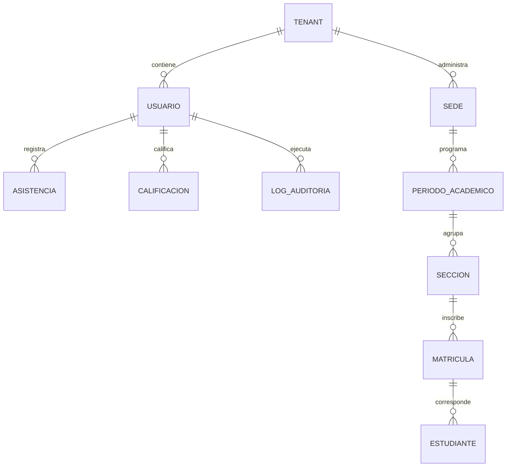

# ESPECIFICACIÓN Y DOCUMENTACIÓN DEL STACK TECNOLÓGICO DEL PROYECTO
## Plataforma Integral de Gestión Académica e Información Institucional

### Planteles de Aplicación "Guamán Poma de Ayala" — UNSCH
**Servicio Social Universitario (SSU IS-480, Semestre 2026-II)**  
**Escuela Profesional de Ingeniería de Sistemas — EPIS UNSCH**  
**Versión:** 1.0 | **Fecha:** Septiembre de 2026  

---

## 1. RESUMEN EJECUTIVO DEL STACK TECNOLÓGICO

El ecosistema tecnológico ha sido seleccionado bajo criterios rigurosos de **rendimiento, mantenibilidad, portabilidad multiplataforma, seguridad criptográfica y resiliencia operativa Offline-First**, garantizando el soporte integral a los **71 Requisitos Funcionales (`RF-01` al `RF-71`)** y **20 Requisitos No Funcionales (RNF)** distribuidos en los 5 squads de desarrollo.

```
┌────────────────────────────────────────────────────────────────────────────────────────┐
│                               CAPA DE CLIENTE / FRONTEND                               │
│        Flutter 3.35.x (Dart 3.9.x) • Material Design 3 • Clean Architecture            │
│  [Flutter Web Responsive (PWA) │ Flutter Desktop (Kiosco) │ Mobile-Friendly Layout]    │
├────────────────────────────────────────────────────────────────────────────────────────┤
│                          CAPA DE SEGURIDAD, GATEWAY Y RED                              │
│       Nginx Reverse Proxy • TLS 1.3 (HTTPS) • WSS (WebSockets) • JWT Interceptor       │
├────────────────────────────────────────────────────────────────────────────────────────┤
│                             CAPA DE BACKEND Y SERVICIOS                                │
│       API RESTful Modular (Node.js LTS / TypeScript / Clean Architecture)              │
│   [Auth JWT/RBAC │ Kiosco Sync Worker │ Engine Modo Excel │ Motor CNEB │ Validador QR] │
├────────────────────────────────────────────────────────────────────────────────────────┤
│                       CAPA DE DATOS, PERSISTENCIA Y CACHÉ                              │
│  PostgreSQL 16+ (Multi-Tenant `tenant_id`) │ Redis 7+ (Caché & PubSub) │ Hive/IndexedDB│
├────────────────────────────────────────────────────────────────────────────────────────┤
│                           DEVOPS, CALIDAD Y ENTORNOS                                   │
│    Docker & Compose • Git / GitFlow • GitHub Actions CI/CD • flutter_lints 5.0.0       │
└────────────────────────────────────────────────────────────────────────────────────────┘
```

---

## 2. FICHA TÉCNICA RESUMIDA POR CAPAS

| Capa del Sistema | Tecnología Principal | Versión Base | Propósito en el Proyecto |
|---|---|:---:|---|
| **Frontend Framework** | **Flutter** | `3.35.x Stable` | Framework UI multiplataforma reactivo para Web, Desktop y PWA. |
| **Lenguaje Frontend** | **Dart** | `3.9.x` | Lenguaje orientado a objetos fuertemente tipado con Sound Null Safety. |
| **Arquitectura Frontend** | **Feature-First + Clean Architecture** | Estándar | Modularización estricta por squad (`lib/features/squad_[X]_[modulo]`). |
| **Gestor de Estado** | **Riverpod / Provider** | Reciente | Inyección de dependencias desacoplada y estado predecible sin fugas. |
| **Diseño y Estilos** | **Material Design 3 (M3)** | M3 Spec | Sistema de diseño institucional (`app_theme.dart`) con tokens oficiales. |
| **Persistencia Local (Offline)** | **Hive / IndexedDB** | `2.x / W3C` | Búfer local cifrado en navegador/desktop para Kiosco Offline-First (`RF-25`). |
| **Protocolo en Tiempo Real** | **WebSockets (`wss://`)** | RFC 6455 | Difusión instantánea de asistencia de aula (`RF-27`) y sincronización. |
| **Backend Runtime** | **Node.js** | `v20+ LTS` | Entorno de ejecución asíncrono y de alta concurrencia para API RESTful. |
| **Lenguaje Backend** | **TypeScript** | `5.x` | Tipado estricto de contratos JSON, DTOs y lógica de negocio. |
| **Base de Datos Principal** | **PostgreSQL** | `16+` | Motor relacional ACID con soporte nativo de JSONB y aislamiento multi-tenant. |
| **Motor de Caché y Sesiones** | **Redis** | `7+` | Almacén en memoria para blacklist de JWT, rate limiting y pub/sub WebSocket. |
| **Criptografía Documental** | **SHA-256 + QR Code** | FIPS 180-4 | Sello inmutable y verificación pública de boletas y carnés oficiales (`RF-60`). |
| **Contenedores y Despliegue** | **Docker & Docker Compose** | Multi-stage | Empaquetado reproducible y despliegue unificado de frontend, backend y BD. |
| **Servidor Web y Proxy** | **Nginx** | `1.24+` | Reverse proxy, terminación SSL TLS 1.3, balanceo y entrega de estáticos. |

---

## 3. CAPA DE PRESENTACIÓN: FLUTTER & DART

### 3.1 Justificación Técnica de Flutter
1. **Un Solo Código Base (*Single Codebase*):** Permite desplegar el sistema como **Aplicación Web Responsive** para docentes/directivos y compilar para **Windows Desktop** en el caso del Kiosco de Portería de alta velocidad, garantizando 100% de coherencia lógica y visual.
2. **Alto Rendimiento en Vistas Complejas:** El motor de renderizado de Flutter (CanvasKit / Skia / Impeller) permite manipular la planilla de notas ("Modo Excel") con cientos de celdas interactivas manteniendo 60 FPS estables sin bloqueos del DOM tradicional.
3. **Soporte PWA (Progressive Web App):** Capacidad de instalación local en navegadores web en tabletas y laptops de los docentes, facilitando el acceso directo sin descargas de tiendas externas.

### 3.2 Paquetes y Librerías Flutter Clave

| Paquete / Dependencia | Versión Referencial | Justificación y Uso Funcional en el Proyecto |
|---|:---:|---|
| **`flutter`** | `sdk: flutter` | Núcleo del framework y motor gráfico. |
| **`cupertino_icons`** | `^1.0.8` | Iconografía complementaria de alta legibilidad. |
| **`http` / `dio`** | `^1.x / ^5.x` | Cliente HTTP avanzado con interceptores para inyección automática de tokens JWT (`Bearer`), manejo de timeouts y refresco silencioso de sesión. |
| **`web_socket_channel`** | `^3.0.x` | Canal bidireccional en tiempo real para la toma rápida de asistencia en aula y difusión instantánea hacia la pantalla de portería y dirección (`RF-27`). |
| **`hive` / `hive_flutter`** | `^2.2.x` | Base de datos local NoSQL ultrarrápida y ligera para almacenar el búfer de asistencias en el Kiosco Offline-First (`RF-25`), compatible con IndexedDB en Web y almacenamiento local en Windows. |
| **`shared_preferences`** | `^2.2.x` | Persistencia de preferencias del usuario local (modo de tema, ID de sección seleccionada, credenciales de sesión en caché). |
| **`fl_chart`** | `^0.68.x` | Librería reactiva de visualización de datos: Mapas de Calor con navegación Drill-Down (`RF-49`), Gráfico de Radar de la Ficha 360° (`RF-56`) y Gráficas de impacto del SSU IS-480 (`RF-57`). |
| **`qr_flutter`** | `^4.1.x` | Generación y renderizado dinámico de códigos QR en pantalla para carnés escolares y tokens de verificación documental (`RF-26`, `RF-60`). |
| **`pdf` / `printing`** | `^3.10.x` | Maquetación programática vectorial en cliente para previsualizar e imprimir carnés escolares, fichas de practicantes y boletas oficiales. |
| **`flutter_lints`** | `^5.0.0` | Conjunto oficial de reglas de análisis estático activadas en `analysis_options.yaml` para asegurar 0 errores y 0 advertencias de calidad. |

### 3.3 Sistema de Diseño e Identidad Visual (`AppTheme`)
El frontend implementa una identidad visual propia basada en **Material Design 3 (M3)** centralizada en [`lib/core/theme/app_theme.dart`](lib/core/theme/app_theme.dart):
* **Verde Botella Institucional (`#1B4D3E`):** Representa la identidad institucional de los Planteles de Aplicación "Guamán Poma de Ayala".
* **Azul UNSCH (`#0B2F64`):** Color heráldico de la Universidad Nacional de San Cristóbal de Huamanga.
* **Escala Normativa Oficial CNEB (MINEDU):**
  * `AD` (Logro Destacado): Verde Esmeralda (`#2E7D32`)
  * `A` (Logro Esperado): Azul Cobalto (`#1565C0`)
  * `B` (En Proceso): Amarillo Ámbar (`#F9A825`)
  * `C` (En Inicio): Rojo Carmesí (`#C62828`)
* **Tipografía:** Tipografía moderna sans-serif legible con jerarquía de encabezados (H1 a H6) y textos de alta densidad para tablas analíticas.

---

## 4. CAPA DE BACKEND Y SERVICIOS RESTFUL

### 4.1 Entorno de Ejecución y Lenguaje
* **Runtime:** Node.js (v20+ LTS) o equivalente modular.
* **Lenguaje:** TypeScript 5.x con tipado estricto (`strict: true` en `tsconfig.json`).
* **Paradigma Arquitectónico:** Clean Architecture organizada en 4 capas concéntricas:
  1. **Dominio:** Entidades puras y reglas de negocio del colegio (cálculo de promedios CNEB, ponderaciones, límites de inasistencia).
  2. **Aplicación / Casos de Uso:** Orquestadores de flujo de negocio (ej. `RegistrarAsistenciaUseCase`, `CalcularFicha360UseCase`).
  3. **Adaptadores / Controladores:** Endpoints RESTful JSON y controladores de WebSockets.
  4. **Infraestructura:** Repositorios de acceso a base de datos, clientes Redis, generadores de PDF y servicios de firma hash.

### 4.2 Seguridad, Autenticación y Autorización
* **Protocolo de Autenticación:** JSON Web Tokens (JWT) dual:
  * **Access Token:** Corta duración (15 a 30 minutos), firmado mediante algoritmo HMAC-SHA256 (`HS256`) o RSA (`RS256`). Contiene `sub`, `email`, `role`, `tenant_id` y `permissions[]`.
  * **Refresh Token:** Larga duración (7 días), almacenado de forma segura con revocación inmediata en Redis ante cierre de sesión forzado.
* **Control de Acceso Basado en Roles (RBAC):**
  * Guards / Middlewares que interceptan cada endpoint verificando los roles autorizados (`ADMIN`, `DIRECTIVO`, `DOCENTE`, `PRACTICANTE`, `ESTUDIANTE`).
* **Protección de Contraseñas:** Algoritmo `bcryptjs` con factor de coste de salting igual a 12 (`rounds = 12`).
* **Mitigación de Ataques:**
  * **Rate Limiting:** Máximo 5 intentos fallidos de login por minuto por IP antes de bloqueo temporal en Redis.
  * **CORS:** Lista blanca restringida a dominios institucionales autorizados.
  * **Cabeceras HTTP:** Implementación de `helmet` (HSTS, No-Sniff, XSS-Protection, Frameguard).

---

## 5. CAPA DE PERSISTENCIA Y ALMACENAMIENTO DE DATOS



### 5.1 Base de Datos Relacional: PostgreSQL 16+
* **Transaccionalidad ACID:** Integridad estricta en el guardado en cascada de notas, matrículas y registros de auditoría.
* **Estrategia Multi-Tenant:**
  * Todas las tablas maestras incorporan la clave `tenant_id UUID NOT NULL` indexada en B-Tree.
  * Garantiza el aislamiento lógico total de los Planteles de Aplicación "Guamán Poma de Ayala", dejando el sistema preparado para futuras escuelas sin alterar el código núcleo.
* **Auditoría Inmutable (Ley N.° 29733):**
  * Tabla `logs_auditoria` protegida con Triggers a nivel de base de datos que anulan cualquier intento de instrucción `DELETE` o `UPDATE`.
  * Registro de: `id`, `usuario_id`, `ip_origen`, `user_agent`, `accion`, `entidad`, `datos_anteriores (JSONB)`, `datos_nuevos (JSONB)` y `timestamp_utc`.

### 5.2 Almacén en Memoria y Caché: Redis 7+
* **Caché de Consultas Frecuentes:** Catálogo del CNEB, escalas de notas y periodos académicos con TTL para respuesta ultrarrápida (< 50ms).
* **Pub/Sub para WebSockets:** Permite escalar los eventos en tiempo real entre múltiples instancias del servidor sin perder mensajes.
* **Gestión de Sesiones:** Control activo de listas negras de tokens invalidados (*token revocation blacklist*).

### 5.3 Persistencia de Contingencia Local: IndexedDB / Hive
* **Kiosco Offline-First (`RF-25`):** Cuando la portera o vigilante escanea carnés QR en la puerta del colegio y no hay conexión a internet, el evento de ingreso se escribe en una cola local atómica.
* Al recuperar conectividad (detección mediante evento de red en Flutter), un worker en segundo plano envía las transacciones acumuladas en lote (*batch sync*) con resolución de duplicados mediante clave `idempotency_key`.

---

## 6. CRIPTOGRAFÍA Y VERIFICACIÓN DOCUMENTAL

* **Algoritmo de Digest:** **SHA-256 (Secure Hash Algorithm - 256 bits)**.
* **Flujo de Sellado de Boletas y Carnés (`RF-60`):**
  1. Al generarse el PDF oficial de una boleta de calificaciones o carné escolar, el backend genera una cadena canónica con los datos del documento (ID Estudiante, Periodo, Notas Oficiales, Fecha de Emisión, Clave Secreta Institucional).
  2. Se calcula el digest criptográfico `SHA-256`.
  3. El hash resultante se almacena en la tabla `documentos_verificacion` y se incrusta en el código QR del PDF en formato de URL pública:  
     `https://guamanpoma.unsch.edu.pe/verificar?doc_id=DOC-2026-X&hash=e3b0c44298fc1c149...`
  4. Cualquier tercero o entidad universitaria que escanee el código QR físico accede al portal web de verificación pública institucional para constatar que el documento no ha sido adulterado.

---

## 7. INFRAESTRUCTURA, DEVOPS Y CONTROL DE CALIDAD

### 7.1 Contenedorización con Docker
El despliegue está estandarizado mediante `Docker` y orquestado con `docker-compose.yml`:
* **Contenedor 1 (Frontend):** Flutter Web compilado en estáticos servido por **Nginx Alpine** (imagen ligera < 30 MB).
* **Contenedor 2 (Backend API):** Node.js LTS en Alpine Linux ejecutando el servicio REST y WebSocket Gateway.
* **Contenedor 3 (Base de Datos):** `postgres:16-alpine` con volúmenes persistentes y scripts de migración inicial.
* **Contenedor 4 (Caché):** `redis:7-alpine` configurado con persistencia AOF/RDB.

### 7.2 Flujo de Ramas Git (GitFlow Ligero)
* **`main` (Producción):** Código blindado, probado y listo para sustentaciones y demos formales.
* **`dev` (Integración):** Rama central de desarrollo donde confluyen los módulos de los 5 squads.
* **`feature/squad-[X]-[funcionalidad]`:** Ramas de trabajo aisladas por squad:
  * `feature/squad-1-jwt-rbac`
  * `feature/squad-2-kiosco-offline`
  * `feature/squad-3-modo-excel`
  * `feature/squad-4-mapas-calor`
  * `feature/squad-5-verificacion-qr`

### 7.3 Calidad de Código y Pruebas Automatizadas
* **Análisis Estático:** Validación obligatoria mediante `flutter analyze` configurado en `analysis_options.yaml` (0 errores, 0 warnings).
* **Pruebas Unitarias y de Widgets:** Suite de `flutter_test` para validar lógica de promedios CNEB, debounce de 400ms, transiciones de estado y renderizado de componentes.

---

## 8. MATRIZ DE ASIGNACIÓN TECNOLÓGICA POR SQUAD

| Squad Técnico | Líder Técnico | Tecnologías y Librerías Principales |
|---|---|---|
| **Squad 1: Core y Seguridad** | Brandon Montero (`@brandonmontero27-g`) | • Flutter Material 3 (Login, Perfil, Configuración)<br>• Node.js / TypeScript (AuthService, JWT HS256, bcrypt)<br>• PostgreSQL 16 (RBAC, Multi-Tenant, Auditoría Ley 29733)<br>• Redis 7 (Tokens blacklist, Rate Limiting) |
| **Squad 2: Matrícula y Asistencia** | Eduardo Paipay (`@Eduardo-Sebastian-Paipay-Vega`) | • Flutter Web + Desktop (Kiosco Portería)<br>• `hive` / `indexeddb` (Búfer Offline-First)<br>• `web_socket_channel` (Transmisión en tiempo real en aula)<br>• `qr_flutter` & `pdf` (Generación masiva de carnés QR) |
| **Squad 3: Calificaciones y Modo Excel** | Steve Ovalle (`@steveovalle27-lgtm`) | • Flutter Data Grid / Custom Table (Planilla Modo Excel)<br>• `FocusNode` & `HardwareKeyboard` (Navegación ágil por celdas)<br>• Debounce 400ms (`dart:async` Timer / Stream)<br>• Motor de reglas Dart/TypeScript (Conversión Vigesimal a CNEB) |
| **Squad 4: Analítica y Dashboards** | Grissel Rodríguez (`@Arascely`) | • `fl_chart` (Mapas de calor interactivos Drill-Down)<br>• Custom Radar Chart (Ficha 360° del estudiante)<br>• PostgreSQL Aggregations & Views (Métricas SSU IS-480)<br>• Algoritmos de semaforización diagnóstica (Verde, Amarillo, Rojo) |
| **Squad 5: Secretaría y Portal Web** | Cesar Leon (`@cesarleon27-ai`) | • `pdf` & `printing` (Boletas oficiales y actas consolidadas)<br>• Motor Criptográfico SHA-256 (Sello de verificación)<br>• Flutter Web Responsive (Portal web público y cartelera)<br>• Endpoint público de validación de códigos QR |

---

## 9. CONCLUSIÓN

El stack tecnológico seleccionado garantiza un balance óptimo entre **modernidad, rendimiento, simplicidad operativa y rigor académico**. Permite que el equipo de desarrollo cumpla con los 71 Requisitos Funcionales en el tiempo estipulado para el **Servicio Social Universitario IS-480**, entregando a los **Planteles de Aplicación "Guamán Poma de Ayala"** un sistema de alta calidad técnica y operativa.
